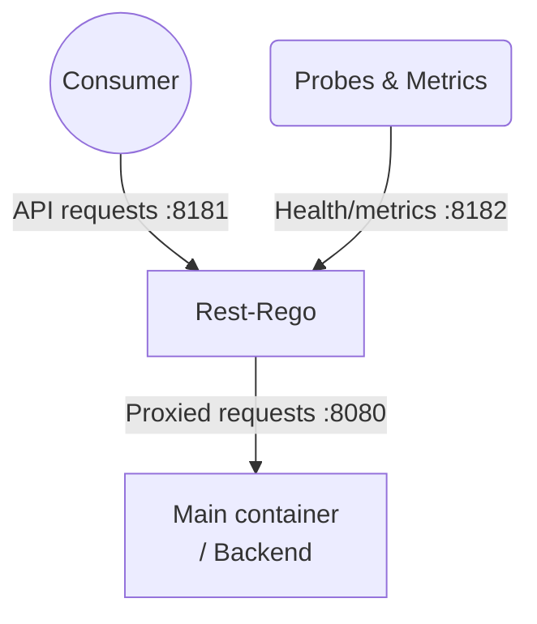

# 🛂 rest-rego


Protect your REST API with Rego policies using the powerful Open Policy Agent (OPA) policy-engine.

Authorization-layer as a sidecar using Azure Applications-authorization, ensuring your API backend is secure and compliant.

__Goals / Features:__

* REST-Authorization for any REST-service
* Effective and documented policy-engine
* Deploy alongside your service (policy-with-code)
* Minimal setup requirements
* Version-control for policies
* Teams/developers maintain their own policies

__Out-of-bounds / Limits__

* Only for software consumers (no login-page or similar)

__How it's done:__

* Sidecar in front of the actual service using Golang `httputil.ReverseProxy`
* Utilizes the [Rego](https://www.openpolicyagent.org/docs/latest/policy-language/) policy-language from [Open Policy Agent](https://www.openpolicyagent.org/)
* Minimal Azure setup needed, just the Azure Tenant ID and an App
* Built as both container and executable
* [Examples](./examples) for Kubernetes deployment

__Extras:__

* [Tests](./tests)

__Availability:__

* Binaries as downloads in each Release
* Containers in [Docker Hub `lindex/rest-rego'](https://hub.docker.com/r/lindex/rest-rego)

---

## 🤔 Methods
We currently support 2 methods of validation:
* [JWT](docs/JWT.md) (recommended) - Uses standard JSON Web Tokens for authentication, simpler setup and better performance
* [Azure Graph](docs/AZURE.md) - Uses Azure Graph API for verification, more detailed but requires additional API calls

## 👟 Getting Started

### Quick Start
1. **Install rest-rego**:
   ```bash
   # Using Docker
   docker pull lindex/rest-rego:latest
   
   # Or download binary from GitHub releases
   ```

2. **Create a basic policy** in `./policies/request.rego`:
   ```rego
   package policies
   
   default allow := false
   
   # Allow specific applications (JWT)
   allow if {
     input.jwt.appid == "your-application-id"
   }

   # Allow specific applications (Azure Graph)
   allow if {
     input.user.appId == "your-application-id"
   }
   ```

3. **Run rest-rego**:
   ```bash
   # For JWT verification (recommended)
   docker run -p 8181:8181 -p 8182:8182 \
     -e WELLKNOWN_OIDC="https://login.microsoftonline.com/YOUR-TENANT-ID/v2.0/.well-known/openid-configuration" \
     -e JWT_AUDIENCES="your-audience" \
     -e BACKEND_PORT="your-backend-http-port" \
     -v ./policies:/policies \
     lindex/rest-rego:latest
     
   # For Azure Graph verification
   docker run -p 8181:8181 -p 8182:8182 \
     -e AZURE_TENANT="your-tenant-id" \
     -e BACKEND_PORT="your-backend-http-port" \
     -v ./policies:/policies \
     lindex/rest-rego:latest
   ```

## 🌐Networking

Rest-rego acts as a reverse proxy with the following port configuration:
- Port `8181`: Default port for incoming API requests (configurable with `LISTEN_ADDR` env-var or `--listen` argument)
- Port `8182`: Health/readiness probes and `/metrics` endpoint (configurable with `MGMT_ADDR` env-var or `--management` argument)
- Backend service: Default port `8080` (configurable with `BACKEND_PORT` env-var or `--backend-port` argument)



## 🛡️ Policy

We are using the Rego policy language from the OpenPolicyAgent as engine.

Links:
* [Rego Playground](https://play.openpolicyagent.org/)

### Input data

```http
GET /user/someone
Authorization: Bearer <token-for-id-11112222-3333-4444-5555-666677778888>
```

The above query would generate the following data as input to the policy (for Azure Graph):
```json
{
  "request": {
    "method": "GET",
    "path": [...],
    "headers": {
      "Authorization": "Bearer <HIDDEN-VALUE>",
    },
    "auth": {
      "kind": "Bearer",
      "token": "<HIDDEN-VALUE>"
    },
    "size": 0
  },
  "jwt": {
    "appid": "<APPID>",
    "appidacr": "1",
    "aud": [ "<GUARD_APPIDURI>" ],
    "exp": "2025-03-24T11:41:37Z",
    "iat": "2025-03-24T10:36:37Z",
    "idp": "https://sts.windows.net/<TENANT>/",
    "iss": "https://sts.windows.net/<TENANT>/",
    "nbf": "2025-03-24T10:36:37Z",
    "oid": "<OBJECTID_OF_CONSUMER_APP>",
    "sub": "<OBJECTID_OF_CONSUMER_APP>",
    "tid": "<TENANT>",
    "ver": "1.0"
    ...
  }
}
```
| Field                       | Explanation |
| --------------------------- | ----------- |
| request                     | Information about the incoming request
| request.method              | HTTP Method |
| request.path                | URL split as an array |
| request.size                | Size of request body |
| request.headers             | Key/Value of a request headers |
| auth                        | Parsed values of the `Authorization` header |
| auth.kind                   | Part 1 of the auth-value, usually 'Bearer' or 'Basic' |
| auth.token                  | Part 2 of the auth-value, usually the bearer-token |
| auth.user                   | Username for Basic auth |
| auth.password               | Password for Basic auth |
| jwt.*                       | JWT claims when using the [JWT](docs/JWT.md) method |
| user.*                      | User info then using the [Azure Graph](docs/AZURE.md) method |

### Simple policy

```rego
package policies  # package name is required, but the name is not relevant for rest-rego

# Set "allow" to false, in case it's not allowed in any other rule
default allow := false

# This set "allow" to true if the application-id is one of the valid
allow if {
	valid_apps := {
		"11112222-3333-4444-5555-666677778888", # name-of-application-1
		"22223333-4444-5555-6666-777788889999", # name-of-application-2
		"33334444-5555-6666-7777-888899990000", # name-of-application-3
	}
	input.jwt.appid in valid_apps
}

# This set "allow" to true if the url matches "/public/*"
allow if {
	input.request.path[0] == "public"
}
```

### Result
The policy will output all "public" variables (i.e 'allow' in the example above).

If _allow is false_ (or not available) then the request will be denied using HTTP-status 403 'Forbidden'

If the request is allowed, the backend will be called and all result-values will be sent along as HTTP-headers in the following format: `X-Restrego-Variablename`. Any underscore '_' in a variable-name will be converted into a regular '-' character.

You can use the `--debug` option to print both input and result for all requests.

The above example will create the following header:
```
X-Restrego-Allow: false
```

## 🪧 Application Options & Environment Variables

| Option | Env-var | Description | Default |
| ------ | ------- | ----------- | ------- |
| -v, --verbose | | Enable more logging |
| --debug | | Dump all policy input and result |
| -d, --dir DIR | POLICY_DIR | Folder where policies are located | ./policies |
| -r, --requestrego FILE | REQUEST | Filename of policy for incoming requests | request.rego |
| --pattern | FILE_PATTERN | File-pattern to match | *.rego |
| -l, --listen ADDR | LISTEN_ADDR | port for to listen on for proxy | :8181 |
| -m, --management ADDR | MGMT_ADDR | port to listen on for management (probes) | :8182 |
| -t, --azure-tenant ID | AZURE_TENANT | Azure Tenant ID | _empty_ |
| -h, --auth-header HEADER | AUTH_HEADER | HTTP-Header to get token from | Authorization |
| -s, --backend-scheme | BACKEND_SCHEME | 'http' or 'https' for the backend container | http |
| -h, --backend-host | BACKEND_HOST | hostname for the backend container | localhost |
| -p, --backend-port | BACKEND_PORT | Port-number for the backend container | 8080 |
| -w, --well-known | WELLKNOWN_OIDC | URL to WellKnown OIDC config | |
| -u, --audience | JWT_AUDIENCES | Valid JWT Audience values | |

## 🔍 Troubleshooting

### Common Issues

#### Authentication Failures
- Ensure your Azure Tenant ID is correctly configured
- Verify your access token is valid and not expired
- Check logs with `--verbose` flag for detailed authentication flow

#### Policy Evaluation Issues
- Use the `--debug` flag to inspect policy input and results
- Validate your policy syntax in the [Rego Playground](https://play.openpolicyagent.org/)
- Common mistake: Package name must match filename (case-sensitive)

## 👥 Contributing

We welcome contributions to rest-rego! Please feel free to submit a pull request or create an issue to report bugs or request features.
