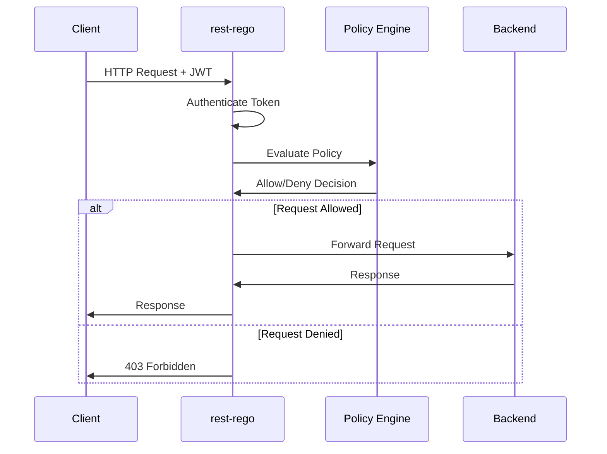

# 🛂 rest-rego


**High-performance authorization sidecar that protects REST APIs using Open Policy Agent (OPA) Rego policies.**

rest-rego acts as a reverse proxy with policy-based access control, supporting both JWT (OIDC) and Azure Graph authentication. Built in Go for minimal latency (<5ms overhead) and high throughput (5000+ req/s per instance).

## Why rest-rego?

**Focus on business logic, not authorization boilerplate.** Deploy rest-rego as a sidecar and let it handle authentication and authorization so your application doesn't have to.

- ✅ **Zero-trust authorization** - Deny-by-default security model
- ✅ **Policy-as-code** - Version controlled, testable, auditable OPA Rego policies
- ✅ **Hot policy reload** - Update rules in <1 second without restart
- ✅ **High performance** - <5ms latency, 5000+ req/s per instance
- ✅ **Flexible authentication** - JWT (OIDC) or Azure Graph validation
- ✅ **Zero code changes** - Deploy as sidecar, your app stays the same
- ✅ **Production-grade** - Prometheus metrics, health checks, structured logging

**Read more:** [WHY.md](./WHY.md) - Detailed comparison with DIY auth and API gateways

## Key Features

| Feature                 | Description                                                  |
|-------------------------|--------------------------------------------------------------|
| **REST API Protection** | Reverse proxy with policy enforcement for any REST service   |
| **OPA Rego Policies**   | Declarative authorization rules using proven policy language |
| **Sidecar Deployment**  | Deploy alongside your service (policy-with-code pattern)     |
| **Hot Reload**          | Update policies without service restart (<1s)                |
| **Multi-Auth**          | JWT (OIDC) or Azure Graph authentication methods             |
| **Version Control**     | Policies in Git alongside application code                   |
| **Production Ready**    | Metrics, health checks, graceful shutdown, high availability |

## Use Cases

- **Microservices** - Consistent authorization across all services
- **Zero-Trust Architecture** - Deny-by-default with explicit allow policies
- **Compliance** - Auditable policy changes with complete version history
- **Multi-Tenant** - Tenant-aware policies using JWT claims
- **API Gateway Alternative** - Lightweight, focused on authorization only

## Availability

- **Docker Image**: [`lindex/rest-rego`](https://hub.docker.com/r/lindex/rest-rego) on Docker Hub
- **Binaries**: [GitHub Releases](https://github.com/AB-Lindex/rest-rego/releases)
- **Examples**: [Kubernetes deployments](./examples/kubernetes/) and [sample policies](./policies/)

---

## 🚀 Quick Start

### 1. Choose Authentication Method

rest-rego supports multiple authentication methods:

| Method | Best For | Setup Complexity | Performance |
|--------|----------|------------------|-------------|
| **[JWT (Standard OIDC)](docs/JWT.md)** ⭐ | Most use cases, Azure AD, any OIDC provider | Simple | Fastest (<1ms) |
| **[JWT (WSO2)](docs/WSO2.md)** | WSO2 API Manager environments | Moderate | Fast (<2ms) |
| **[Azure Graph](docs/AZURE.md)** | Azure-heavy environments needing app metadata | Moderate | Good (with caching) |

**Recommendation**: Use JWT authentication for better performance and simpler setup. Choose WSO2 variant if using WSO2 API Manager with custom claims. Azure Graph is best when you need real-time Azure AD application metadata.

### 2. Install rest-rego

```bash
# Using Docker (recommended)
docker pull lindex/rest-rego:latest

# Or download binary from GitHub releases
# https://github.com/AB-Lindex/rest-rego/releases
```

### 3. Create Authorization Policy

Create a policy file `./policies/request.rego`:

```rego
package policies

# Deny by default (fail-closed security)
default allow := false

# Allow specific applications (JWT authentication)
allow if {
  input.jwt.appid == "11112222-3333-4444-5555-666677778888"
}

# Allow based on roles
allow if {
  "admin" in input.jwt.roles
}

# Allow public endpoints
allow if {
  input.request.path[0] == "public"
}
```

### 4. Run rest-rego

**JWT Authentication - Standard OIDC (Recommended):**
```bash
docker run -p 8181:8181 -p 8182:8182 \
  -e WELLKNOWN_OIDC="https://login.microsoftonline.com/YOUR-TENANT-ID/v2.0/.well-known/openid-configuration" \
  -e JWT_AUDIENCES="your-api-audience" \
  -e BACKEND_PORT="8080" \
  -v $(pwd)/policies:/policies \
  lindex/rest-rego:latest
```

**JWT Authentication - WSO2 API Manager:**
```bash
docker run -p 8181:8181 -p 8182:8182 \
  -e WELLKNOWN_OIDC="https://api-manager.example.com/oauth2/token/.well-known/openid-configuration" \
  -e JWT_AUDIENCE_KEY="http://wso2.org/claims/apiname" \
  -e JWT_AUDIENCES="YourAPIName" \
  -e AUTH_HEADER="X-Jwt-Assertion" \
  -e AUTH_KIND="" \
  -e BACKEND_PORT="8080" \
  -v $(pwd)/policies:/policies \
  lindex/rest-rego:latest
```

**Azure Graph Authentication:**
```bash
docker run -p 8181:8181 -p 8182:8182 \
  -e AZURE_TENANT="your-tenant-id" \
  -e BACKEND_PORT="8080" \
  -v $(pwd)/policies:/policies \
  lindex/rest-rego:latest
```

### 5. Test Authorization

```bash
# Get a JWT token from your identity provider
TOKEN="your-jwt-token"

# Make authorized request
curl -H "Authorization: Bearer $TOKEN" http://localhost:8181/api/endpoint
```

**Next steps:**
- Read [Policy Development Guide](./docs/POLICY.md) for advanced policy patterns
- See [Configuration Reference](./docs/CONFIGURATION.md) for all options
- Check [Deployment Guide](./docs/DEPLOYMENT.md) for production setup

---

## Architecture Overview

rest-rego operates as a reverse proxy between clients and your backend service:



### Port Configuration

| Port     | Purpose                   | Exposed To         |
|----------|---------------------------|--------------------|
| **8181** | API proxy (main traffic)  | External clients   |
| **8182** | Health checks & metrics   | Monitoring systems |
| **8080** | Backend service (default) | rest-rego only     |

### Deployment Patterns

**Sidecar (Recommended):**
- Deploy rest-rego alongside each service
- Share localhost network for minimal latency
- Policies deployed with application code

**Gateway:**
- Single rest-rego for multiple backends
- Centralized authorization point
- Useful for legacy systems

**Learn more:** [Deployment Guide](./docs/DEPLOYMENT.md) | [Kubernetes Examples](./examples/kubernetes/)

---

## Policy Development

Policies are written in [Rego](https://www.openpolicyagent.org/docs/latest/policy-language/), OPA's policy language.

### Simple Policy Example

```rego
package policies

default allow := false

# Allow specific applications
allow if {
  input.jwt.appid in [
    "11112222-3333-4444-5555-666677778888",
    "22223333-4444-5555-6666-777788889999"
  ]
}

# Allow based on roles
allow if {
  "admin" in input.jwt.roles
}
```

### Policy Input Structure

Policies receive structured request data and authentication context:

```json
{
  "request": {
    "method": "GET",
    "path": ["api", "users", "123"],
    "headers": { ... }
  },
  "jwt": {
    "appid": "...",
    "roles": ["admin"],
    "tenant_id": "..."
  }
}
```

### Hot Reload

Policies reload automatically when files change (typically <1 second):

1. Edit `.rego` file in `./policies/` directory
2. Save the file
3. rest-rego detects change and reloads
4. New requests use updated policy immediately

**Learn more:** [Policy Development Guide](./docs/POLICY.md) - Examples, testing, best practices

---

## Configuration

Common configuration via environment variables:

```bash
# Authentication (JWT - recommended)
export WELLKNOWN_OIDC="https://login.microsoftonline.com/TENANT/v2.0/.well-known/openid-configuration"
export JWT_AUDIENCES="api://your-audience"

# Backend
export BACKEND_PORT="8080"

# Optional
export DEBUG="false"
export POLICY_DIR="./policies"
```

**Learn more:** [Configuration Reference](./docs/CONFIGURATION.md) - Complete options, timeouts, advanced settings

---

## Observability

### Health Checks

```bash
# Liveness (is service alive?)
curl http://localhost:8182/healthz

# Readiness (is service ready for traffic?)
curl http://localhost:8182/readyz

# Prometheus metrics
curl http://localhost:8182/metrics
```

### Key Metrics

| Metric                               | Description                           |
|--------------------------------------|---------------------------------------|
| `restrego_requests_total`            | Total requests by result (allow/deny) |
| `restrego_request_duration_seconds`  | Request latency (p50, p95, p99)       |
| `restrego_auth_total`                | Authentication attempts and results   |
| `restrego_policy_evaluation_seconds` | Policy evaluation duration            |

### Logging

Enable debug mode to see policy input/output:

```bash
rest-rego --debug --verbose
```

**Learn more:** [Observability Guide](./docs/OBSERVABILITY.md) - Metrics, logging, alerting, dashboards

---

## Deployment

### Docker

```bash
docker run -d \
  --name rest-rego \
  -p 8181:8181 \
  -p 8182:8182 \
  -e WELLKNOWN_OIDC="https://your-idp/.well-known/openid-configuration" \
  -e JWT_AUDIENCES="your-audience" \
  -e BACKEND_PORT="8080" \
  -v $(pwd)/policies:/policies:ro \
  lindex/rest-rego:latest
```

### Kubernetes Sidecar

```yaml
containers:
# Your application
- name: app
  image: my-app:latest
  ports:
  - containerPort: 8080

# rest-rego sidecar
- name: rest-rego
  image: lindex/rest-rego:latest
  env:
  - name: BACKEND_PORT
    value: "8080"
  - name: WELLKNOWN_OIDC
    valueFrom:
      configMapKeyRef:
        name: rest-rego-config
        key: WELLKNOWN_OIDC
  ports:
  - containerPort: 8181
  - containerPort: 8182
  volumeMounts:
  - name: policies
    mountPath: /policies
    readOnly: true
```

**Learn more:** [Deployment Guide](./docs/DEPLOYMENT.md) - Docker, Kubernetes, scaling, security best practices

---

## Troubleshooting

### Common Issues

**Authentication failures (401):**
- Verify JWT token is valid: `echo $TOKEN | jwt decode -`
- Check `JWT_AUDIENCES` matches token's `aud` claim
- Ensure OIDC well-known URL is accessible

**Policy denials (403):**
- Enable debug mode: `rest-rego --debug`
- Review policy input and output in logs
- Test policy locally with OPA CLI

**Policy changes not applied:**
- Check file permissions (must be readable)
- Verify policy syntax: `opa check policies/`
- Look for reload events in logs

**Learn more:** [Troubleshooting Guide](./docs/TROUBLESHOOTING.md) - Complete troubleshooting reference

---

## 📚 Documentation

### Core Documentation

| Document                     | Description                                      |
|------------------------------|--------------------------------------------------|
| [WHY.md](./WHY.md)           | Why use rest-rego? Comparison with alternatives  |
| [SECURITY.md](./SECURITY.md) | Security policy and best practices               |
| [PRD.md](./.specs/PRD.md)    | Complete product requirements and specifications |

### Guides

| Guide                                              | Description                              |
|----------------------------------------------------|------------------------------------------|
| [Policy Development](./docs/POLICY.md)             | Writing, testing, and deploying policies |
| [Configuration Reference](./docs/CONFIGURATION.md) | Complete configuration options           |
| [Deployment Guide](./docs/DEPLOYMENT.md)           | Docker, Kubernetes, scaling, security    |
| [Observability](./docs/OBSERVABILITY.md)           | Metrics, logging, alerting, dashboards   |
| [Troubleshooting](./docs/TROUBLESHOOTING.md)       | Common issues and solutions              |
| [Blocked Headers](./docs/BLOCKED-HEADERS.md)       | Multi-layer authorization feature        |

### Authentication Setup

| Guide                                | Description                         |
|--------------------------------------|-------------------------------------|
| [JWT (Standard OIDC)](./docs/JWT.md) | Azure AD, Okta, Auth0, generic OIDC |
| [JWT (WSO2)](./docs/WSO2.md)         | WSO2 API Manager integration        |
| [Azure Graph](./docs/AZURE.md)       | Azure AD Graph authentication       |

### Examples

| Example                                         | Description                              |
|-------------------------------------------------|------------------------------------------|
| [Kubernetes Deployment](./examples/kubernetes/) | Complete K8s manifests and patterns      |
| [Sample Policies](./policies/)                  | Example policy files                     |
| [Test Files](./tests/)                          | HTTP test files and K6 performance tests |

---

## 🤝 Contributing

We welcome contributions to rest-rego!

**Ways to contribute:**
- 🐛 Report bugs via [GitHub Issues](https://github.com/AB-Lindex/rest-rego/issues)
- 💡 Suggest features or improvements
- 📝 Improve documentation
- 🔧 Submit pull requests
- 📖 Share example policies and use cases

**Before contributing:**
1. Check existing issues to avoid duplicates
2. For large changes, open an issue first to discuss
3. Follow existing code style and patterns
4. Add tests for new functionality
5. Update documentation as needed

---

## 📄 License

rest-rego is licensed under the terms specified in [LICENSE](./LICENSE).

---

## 🏷️ Project Information

- **Repository**: [github.com/AB-Lindex/rest-rego](https://github.com/AB-Lindex/rest-rego)
- **Docker Hub**: [lindex/rest-rego](https://hub.docker.com/r/lindex/rest-rego)
- **Maintainer**: AB-Lindex Team
- **Status**: Active Production Project

**Technology Stack**: Go 1.25+, OPA Rego, Prometheus, Docker, Kubernetes
