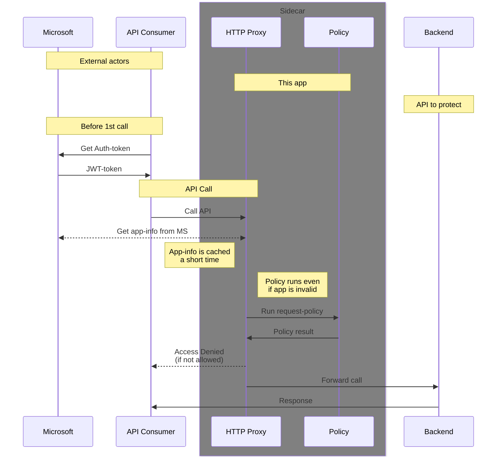
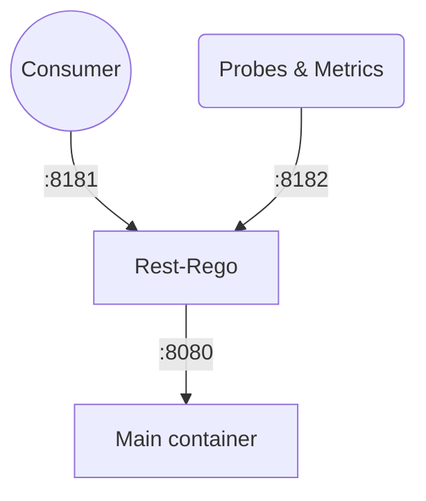

# rest-rego


Protect your REST API with Rego policies using the powerful Open Policy Agent (OPA) policy-engine.

Authorization-layer as a sidecar using Azure Applications-authorization, ensuring your API backend is secure and compliant.

__Goals / Features:__

* REST-Authorization for any REST-service
* Effective and documented policy-engine
* Deploy alongside your service (policy-with-code)
* Minimal setup requirements
* Version-control for policies
* Teams/developers maintain their own policies

__How it's done:__

* Sidecar in front of the actual service using Golang `httputil.ReverseProxy`
* Utilizes the [Rego](https://www.openpolicyagent.org/docs/latest/policy-language/) policy-language from [Open Policy Agent](https://www.openpolicyagent.org/)
* No existing Azure setup needed, just the Azure Tenant ID
* Built as both container and executable
* [Examples](./examples) for Kubernetes deployment

__Extras:__

* [Tests](./tests)

__Availability:__

* Binaries as downloads in each Release
* Containers in [Docker Hub `lindex/rest-rego'](https://hub.docker.com/r/lindex/rest-rego)

---

## Flowchart


## Networking

The rest-rego application uses port `8181` by default for incoming API-requests.
<br/>
It also exposes port `8182` for probes and the `/metrics` endpoint.

The default assumed backend-port is 8080 (easily changed by env-var BACKEND_PORT)



## Identification

Supply access-token as Bearer-authorization

Supported identifications:
* Azure Service Principal / Application

Verification is only done if the supplied token matches the same tenant that the program is running with (se the `--azure-tenant` option)

Verification of access-token is performed using the Graph-API which uses the supplied token to ask for information about itself.

Information is cached for a few minutes.

## 🛡️ Policy

We are using the Rego policy language from the OpenPolicyAgent as engine.

Links:
* [Rego Playground](https://play.openpolicyagent.org/)

### Input data

```http
GET /user/someone
Authorization: Bearer <token-for-id-11112222-3333-4444-5555-666677778888>
```

The above query would generate the following data as input to the policy:
```json
{
  "request": {
    "method": "GET",
    "path": [
      "user",
      "someone"
    ],
    "size": 0,
    "id": "11112222-3333-4444-5555-666677778888"
  },
  "user": {
    "appId": "11112222-3333-4444-5555-666677778888",
    "appOwnerOrganizationId": "ffffffff-eeee-dddd-cccc-bbbbaaaa0000",
    "displayName": "Name-Of-Application",
    "id": "aaaabbbb-cccc-dddd-eeee-ffff00001111",
    "servicePrincipalType": "Application"
  }
}
```
| Field                       | Explanation |
| --------------------------- | ----------- |
| request                     | Information about the incoming request
| request.method              | HTTP Method |
| request.path                | URL split as an array |
| request.size                | Size of request body |
| request.id                  | Application ID of the request (not verified) |
| user                        | Information verified by external authentication-service |
| user.appId                  | Application ID |
| user.appOwnerOrganizationId | Azure Tenant ID |
| user.displayName            | Application Display Name |
| user.id                     | Object ID of Application |
| user.servicePrincipalType   | Type of application (usually 'Application') |

### Simple policy

[!!Note] The package name must currently be the same as the filename, case-sensitive.

```rego
package request.rego

# Set "allow" to false, in case it's not allowed in any other rule
default allow := false

# This set "allow" to true if the application-id is one of the valid
allow if {
	valid_apps := {
		"11112222-3333-4444-5555-666677778888", # name-of-application-1
		"22223333-4444-5555-6666-777788889999", # name-of-application-2
		"33334444-5555-6666-7777-888899990000", # name-of-application-3
	}
	input.user.appId in valid_apps
}

# This set "allow" to true if the url matches "/public/*"
allow if {
	input.request.path[0] == "public"
}
```

### Result
The policy will output all "public" variables (i.e 'allow' in the example above).

If _allow is false_ (or not available) then the request will be denied using HTTP-status 403 'Forbidden'

If the request is allowed, the backend will be called and all result-values will be sent along as HTTP-headers in the following format: `X-Restrego-Variablename`. Any underscore '_' in a variable-name will be converted into a regular '-' character.

You can use the `--debug` option to print both input and result for all requests.

The above example will create the following header:
```
X-Restrego-Allow: false
```

## 🪧 Application Options & Environment Variables

| Option | Env-var | Description | Default |
| ------ | ------- | ----------- | ------- |
| -v, --verbose | | Enable more logging |
| --debug | | Dump all policy input and result |
| -d, --dir DIR | POLICY_DIR | Folder where policies are located | ./policies |
| -r, --requestrego FILE | REQUEST | Filename of policy for incoming requests | request.rego |
| -l, --listen ADDR | LISTEN_ADDR | port for to listen on for proxy | :8181 |
| -m, --management ADDR | MGMT_ADDR | port to listen on for management (probes) | :8182 |
| -t, --azure-tenant ID | AZURE_TENANT | Azure Tenant ID | _empty_ |
| -h, --auth-header HEADER | AUTH_HEADER | HTTP-Header to get token from | Authorization |
| -s, --backend-scheme | BACKEND_SCHEME | 'http' or 'https' for the backend container | http |
| -h, --backend-host | BACKEND_HOST | hostname for the backend container | localhost |
| -p, --backend-port | BACKEND_PORT | Port-number for the backend container | 8080 |

## 🔍 Troubleshooting

### Common Issues

#### Authentication Failures
- Ensure your Azure Tenant ID is correctly configured
- Verify your access token is valid and not expired
- Check logs with `--verbose` flag for detailed authentication flow

#### Policy Evaluation Issues
- Use the `--debug` flag to inspect policy input and results
- Validate your policy syntax in the [Rego Playground](https://play.openpolicyagent.org/)
- Common mistake: Package name must match filename (case-sensitive)

## 👥 Contributing

We welcome contributions to rest-rego! Please feel free to submit a pull request or create an issue to report bugs or request features.
