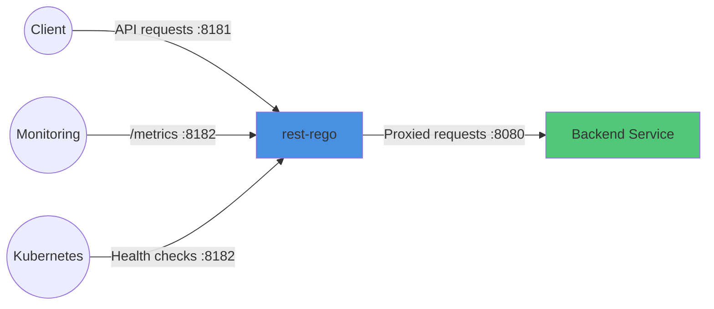
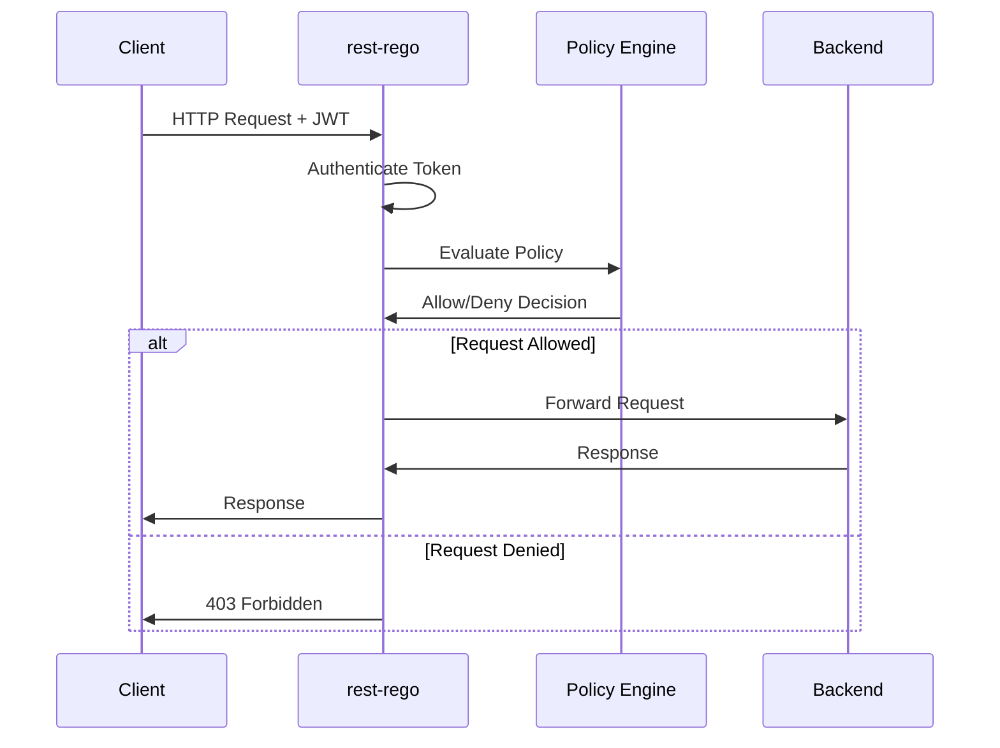

# 🛂 rest-rego


**High-performance authorization sidecar that protects REST APIs using Open Policy Agent (OPA) Rego policies.**

rest-rego acts as a reverse proxy with policy-based access control, supporting both JWT (OIDC) and Azure Graph authentication. Built in Go for minimal latency (<5ms overhead) and high throughput (5000+ req/s per instance).

## Why rest-rego?

**Focus on business logic, not authorization boilerplate.** Deploy rest-rego as a sidecar and let it handle authentication and authorization so your application doesn't have to.

- ✅ **Zero-trust authorization** with deny-by-default security model
- ✅ **Policy-as-code** using OPA Rego - version controlled, testable, auditable
- ✅ **Hot policy reload** - update authorization rules in <1 second without restart
- ✅ **High performance** - <5ms latency overhead, 5000+ req/s throughput per instance
- ✅ **Dual authentication** - JWT (recommended) or Azure Graph validation
- ✅ **Zero code changes** - deploy as sidecar, your app stays the same
- ✅ **Production-grade** - Prometheus metrics, health checks, structured logging

**Read more:** [WHY.md](./WHY.md) - Detailed comparison with DIY auth and API gateways

## Key Features

| Feature | Description |
|---------|-------------|
| **REST API Protection** | Reverse proxy with policy enforcement for any REST service |
| **OPA Rego Policies** | Declarative authorization rules using proven policy language |
| **Sidecar Deployment** | Deploy alongside your service (policy-with-code) |
| **Hot Reload** | Update policies without service restart |
| **Multi-Auth** | JWT (OIDC) or Azure Graph authentication methods |
| **Version Control** | Policies in Git alongside application code |
| **Developer Autonomy** | Teams maintain their own authorization policies |
| **Production Ready** | Metrics, health checks, graceful shutdown, multi-instance support |

## Use Cases

- **Microservices**: Consistent authorization across all services
- **API Gateway Alternative**: Lightweight, focused on authorization only
- **Zero-Trust Architecture**: Deny-by-default with explicit allow policies
- **Compliance**: Auditable policy changes with complete version history
- **Multi-Tenant**: Tenant-aware policies using JWT claims

## Availability

- **Docker Image**: [`lindex/rest-rego`](https://hub.docker.com/r/lindex/rest-rego) on Docker Hub
- **Binaries**: Download from [GitHub Releases](https://github.com/AB-Lindex/rest-rego/releases)
- **Examples**: [Kubernetes deployments](./examples) and sample policies

---

## 🚀 Quick Start

### 1. Choose Authentication Method

rest-rego supports multiple authentication methods:

| Method | Best For | Setup Complexity | Performance |
|--------|----------|------------------|-------------|
| **[JWT (Standard OIDC)](docs/JWT.md)** ⭐ | Most use cases, Azure AD, any OIDC provider | Simple | Fastest (<1ms) |
| **[JWT (WSO2)](docs/WSO2.md)** | WSO2 API Manager environments | Moderate | Fast (<2ms) |
| **[Azure Graph](docs/AZURE.md)** | Azure-heavy environments needing app metadata | Moderate | Good (with caching) |

**Recommendation**: Use JWT authentication for better performance and simpler setup. Choose WSO2 variant if using WSO2 API Manager with custom claims. Azure Graph is best when you need real-time Azure AD application metadata.

### 2. Install rest-rego

```bash
# Using Docker (recommended)
docker pull lindex/rest-rego:latest

# Or download binary from GitHub releases
# https://github.com/AB-Lindex/rest-rego/releases
```

### 3. Create Authorization Policy

Create a policy file `./policies/request.rego`:

```rego
package policies

# Deny by default (fail-closed security)
default allow := false

# Allow specific applications (JWT authentication)
allow if {
  input.jwt.appid == "11112222-3333-4444-5555-666677778888"
}

# Allow based on roles
allow if {
  "admin" in input.jwt.roles
}

# Allow public endpoints
allow if {
  input.request.path[0] == "public"
}
```

### 4. Run rest-rego

**JWT Authentication - Standard OIDC (Recommended):**
```bash
docker run -p 8181:8181 -p 8182:8182 \
  -e WELLKNOWN_OIDC="https://login.microsoftonline.com/YOUR-TENANT-ID/v2.0/.well-known/openid-configuration" \
  -e JWT_AUDIENCES="your-api-audience" \
  -e BACKEND_PORT="8080" \
  -v $(pwd)/policies:/policies \
  lindex/rest-rego:latest
```

**JWT Authentication - WSO2 API Manager:**
```bash
docker run -p 8181:8181 -p 8182:8182 \
  -e WELLKNOWN_OIDC="https://api-manager.example.com/oauth2/token/.well-known/openid-configuration" \
  -e JWT_AUDIENCE_KEY="http://wso2.org/claims/apiname" \
  -e JWT_AUDIENCES="YourAPIName" \
  -e AUTH_HEADER="X-Jwt-Assertion" \
  -e AUTH_KIND="" \
  -e BACKEND_PORT="8080" \
  -v $(pwd)/policies:/policies \
  lindex/rest-rego:latest
```

**Azure Graph Authentication:**
```bash
docker run -p 8181:8181 -p 8182:8182 \
  -e AZURE_TENANT="your-tenant-id" \
  -e BACKEND_PORT="8080" \
  -v $(pwd)/policies:/policies \
  lindex/rest-rego:latest
```

### 5. Test Authorization

```bash
# Get a JWT token from your identity provider
TOKEN="your-jwt-token"

# Make authorized request
curl -H "Authorization: Bearer $TOKEN" http://localhost:8181/api/endpoint
```

**Enable debug mode** to see policy input/output:
```bash
docker run -e DEBUG=true ... lindex/rest-rego:latest
```

---

## �️ Architecture

### Networking

rest-rego acts as a reverse proxy with the following port configuration:

| Port | Purpose | Configurable Via |
|------|---------|------------------|
| **8181** | API requests (proxy) | `LISTEN_ADDR` env var or `--listen` flag |
| **8182** | Health checks & metrics | `MGMT_ADDR` env var or `--management` flag |
| **8080** | Backend service (default) | `BACKEND_PORT` env var or `--backend-port` flag |



### Request Flow



### Deployment Patterns

**Sidecar Pattern (Recommended):**
- Deploy rest-rego alongside each service instance
- Share localhost network for minimal latency
- Policies deployed with application code
- Each service has independent authorization

**Gateway Pattern:**
- Single rest-rego instance for multiple backends
- Centralized authorization point
- Useful for legacy systems without containerization

---

## � Policy Development

rest-rego uses the [Rego policy language](https://www.openpolicyagent.org/docs/latest/policy-language/) from Open Policy Agent (OPA).

### Policy Basics

**Required elements:**
- `package policies` declaration
- `default allow := false` (deny-by-default security)
- `allow` rule(s) that return boolean

**Optional:**
- `url` result for customizing URL labels in metrics (e.g., for granularity or GDPR compliance)

### Policy Input Structure

The policy receives structured input with request details and authentication context:

```json
{
  "request": {
    "method": "GET",
    "path": ["api", "users", "123"],
    "headers": {
      "Authorization": "Bearer <HIDDEN>",
      "Content-Type": "application/json"
    },
    "auth": {
      "kind": "Bearer",
      "token": "<HIDDEN>"
    },
    "size": 0
  },
  "jwt": {
    "appid": "<APPLICATION-ID>",
    "aud": ["<AUDIENCE>"],
    "exp": "2025-03-24T11:41:37Z",
    "iat": "2025-03-24T10:36:37Z",
    "iss": "https://sts.windows.net/<TENANT>/",
    "roles": ["admin", "reader"],
    ...
  }
}
```

| Field | Description |
|-------|-------------|
| `request.method` | HTTP method (GET, POST, PUT, DELETE, etc.) |
| `request.path` | URL path split as array (e.g., `/api/users/123` → `["api", "users", "123"]`) |
| `request.headers` | Request headers (sensitive values hidden in debug logs) |
| `request.auth.kind` | Authentication type (usually "Bearer" or "Basic") |
| `request.auth.token` | Token value (hidden in logs) |
| `request.size` | Request body size in bytes |
| `jwt.*` | JWT claims when using JWT authentication |
| `user.*` | Application info when using Azure Graph authentication |

### Example Policies

**Simple app-based authorization:**
```rego
package policies

default allow := false

# Allow specific applications
allow if {
  valid_apps := {
    "11112222-3333-4444-5555-666677778888", # app-name-1
    "22223333-4444-5555-6666-777788889999", # app-name-2
  }
  input.jwt.appid in valid_apps
}
```

**Role-based access control (RBAC):**
```rego
package policies

default allow := false

# Admins can do everything
allow if {
  "admin" in input.jwt.roles
}

# Readers can only GET
allow if {
  "reader" in input.jwt.roles
  input.request.method == "GET"
}

# Order managers can manage orders
allow if {
  "order-manager" in input.jwt.roles
  input.request.path[0] == "orders"
}
```

**Path-based authorization:**
```rego
package policies

default allow := false

# Public endpoints don't require authentication
allow if {
  input.request.path[0] == "public"
}

# Health check endpoint
allow if {
  input.request.path[0] == "health"
  input.request.method == "GET"
}

# Protected API requires valid application
allow if {
  input.request.path[0] == "api"
  input.jwt.appid != ""
}
```

**Customizing metrics URL labels (GDPR compliance):**
```rego
package policies

default allow := false
default url := ""

# Allow access to user endpoints
allow if {
  input.request.path[0] == "api"
  input.request.path[1] == "users"
  "admin" in input.jwt.roles
}

# Anonymize user IDs in metrics for GDPR compliance
url := "/api/users/:id" if {
  input.request.path[0] == "api"
  input.request.path[1] == "users"
  count(input.request.path) > 2
}

# Generalize order IDs in metrics
url := "/api/orders/:id" if {
  input.request.path[0] == "api"
  input.request.path[1] == "orders"
  count(input.request.path) > 2
}
```

### Policy Testing

Use the [Rego Playground](https://play.openpolicyagent.org/) to test policies interactively.

**Local testing with OPA:**
```bash
# Install OPA CLI
brew install opa  # macOS
# or download from https://www.openpolicyagent.org/docs/latest/#running-opa

# Test your policies
opa test policies/ -v

# Evaluate policy with sample input
echo '{"request": {"method": "GET"}, "jwt": {"appid": "test"}}' | \
  opa eval -d policies/ -I 'data.policies.allow'
```

### Hot Reload

Policy files are automatically reloaded when changed (typically <1 second):

1. Edit `.rego` file in `./policies/` directory
2. Save the file
3. rest-rego detects change and reloads
4. New requests use updated policy

**Notes:**
- Invalid policies are rejected; previous valid policies remain active
- Reload events logged and tracked in metrics
- In-flight requests complete using previous policy version

---

## ⚙️ Configuration

rest-rego supports configuration via environment variables or command-line arguments.

### Core Configuration

| Option | Env Variable | Default | Description |
|--------|--------------|---------|-------------|
| `-v, --verbose` | - | false | Enable verbose logging (debug level) |
| `--debug` | `DEBUG` | false | Print policy input and result for all requests |
| `-d, --directory` | `POLICY_DIR` | `./policies` | Directory containing policy files |
| `--pattern` | `FILE_PATTERN` | `*.rego` | File pattern to match for policies |
| `-r, --requestrego` | `REQUEST_REGO` | `request.rego` | Main policy file for requests |

### Network Configuration

| Option | Env Variable | Default | Description |
|--------|--------------|---------|-------------|
| `-l, --listen` | `LISTEN_ADDR` | `:8181` | Address/port for API proxy |
| `-m, --management` | `MGMT_ADDR` | `:8182` | Address/port for health/metrics |
| `-s, --backend-scheme` | `BACKEND_SCHEME` | `http` | Backend URL scheme (http/https) |
| `-h, --backend-host` | `BACKEND_HOST` | `localhost` | Backend hostname |
| `-p, --backend-port` | `BACKEND_PORT` | `8080` | Backend port number |

### Authentication Configuration

| Option | Env Variable | Default | Description |
|--------|--------------|---------|-------------|
| `-w, --well-known` | `WELLKNOWN_OIDC` | - | OIDC well-known URL(s) for JWT verification |
| `-u, --audience` | `JWT_AUDIENCES` | - | Expected JWT audience value(s) **(required for JWT)** |
| `--audience-key` | `JWT_AUDIENCE_KEY` | `aud` | JWT claim key for audience validation |
| `-t, --azure-tenant` | `AZURE_TENANT` | - | Azure Tenant ID for Graph authentication |
| `-a, --auth-header` | `AUTH_HEADER` | `Authorization` | HTTP header for authentication token |
| `-k, --auth-kind` | `AUTH_KIND` | `bearer` | Expected authentication type |
| `--permissive-auth` | `PERMISSIVE_AUTH` | `false` | Allow unauthenticated requests (treat as anonymous) |

### Timeout Configuration

| Option | Env Variable | Default | Description |
|--------|--------------|---------|-------------|
| `--read-header-timeout` | `READ_HEADER_TIMEOUT` | `10s` | Timeout for reading request headers |
| `--read-timeout` | `READ_TIMEOUT` | `30s` | Timeout for reading entire request |
| `--write-timeout` | `WRITE_TIMEOUT` | `90s` | Timeout for writing response |
| `--idle-timeout` | `IDLE_TIMEOUT` | `120s` | Timeout for idle connections |
| `--backend-dial-timeout` | `BACKEND_DIAL_TIMEOUT` | `10s` | Timeout for backend connection |
| `--backend-response-timeout` | `BACKEND_RESPONSE_TIMEOUT` | `30s` | Timeout for backend response headers |
| `--backend-idle-timeout` | `BACKEND_IDLE_TIMEOUT` | `90s` | Timeout for idle backend connections |

### Configuration Examples

**JWT Authentication:**
```bash
export WELLKNOWN_OIDC="https://login.microsoftonline.com/TENANT-ID/v2.0/.well-known/openid-configuration"
export JWT_AUDIENCES="api://your-api-audience"
export BACKEND_PORT="8080"
export POLICY_DIR="./policies"

rest-rego
```

**Azure Graph Authentication:**
```bash
export AZURE_TENANT="your-tenant-id"
export BACKEND_PORT="8080"
export VERBOSE=true

rest-rego
```

**Multiple OIDC Providers:**
```bash
# Comma-separated or use multiple -w flags
export WELLKNOWN_OIDC="https://provider1.com/.well-known/openid-configuration,https://provider2.com/.well-known/openid-configuration"
export JWT_AUDIENCES="audience1,audience2"

rest-rego
```

**Custom Ports and Backend:**
```bash
rest-rego \
  --listen :9090 \
  --management :9091 \
  --backend-host api-server \
  --backend-port 3000 \
  --backend-scheme https
```

### Configuration Validation

rest-rego validates configuration on startup and exits with clear error messages if invalid:

- ❌ **Conflicting auth**: Cannot use both `AZURE_TENANT` and `WELLKNOWN_OIDC`
- ❌ **Missing audience**: `JWT_AUDIENCES` required when using `WELLKNOWN_OIDC`
- ❌ **Invalid timeouts**: Timeouts must be between 1s and 10m
- ❌ **Invalid directories**: Policy directory must exist and be readable

### Version Information

```bash
rest-rego --version
```

---

## � Observability

### Health Checks

rest-rego provides Kubernetes-compatible health endpoints on the management port (default: 8182):

| Endpoint | Purpose | Response |
|----------|---------|----------|
| `/healthz` | Liveness probe | 200 OK when service is running |
| `/readyz` | Readiness probe | 200 OK when policies loaded and ready |
| `/metrics` | Prometheus metrics | Metrics in Prometheus format |

**Kubernetes configuration:**
```yaml
livenessProbe:
  httpGet:
    path: /healthz
    port: 8182
  initialDelaySeconds: 2
  periodSeconds: 10

readinessProbe:
  httpGet:
    path: /readyz
    port: 8182
  initialDelaySeconds: 2
  periodSeconds: 5
```

### Prometheus Metrics

rest-rego exports detailed metrics for monitoring and alerting:

| Metric | Type | Description |
|--------|------|-------------|
| `restrego_requests_total` | Counter | Total requests by method, path, result (allow/deny) |
| `restrego_request_duration_seconds` | Histogram | Request processing latency (p50, p95, p99) |
| `restrego_auth_total` | Counter | Authentication attempts by method and result |
| `restrego_policy_evaluation_seconds` | Histogram | Policy evaluation duration |
| `restrego_policy_reload_total` | Counter | Policy reload events by result |
| `restrego_jwk_cache_hits_total` | Counter | JWK cache hit rate (JWT mode) |
| `restrego_graph_api_calls_total` | Counter | Microsoft Graph API calls (Azure mode) |

**Example Grafana queries:**
```promql
# Authorization decision rate (allow vs deny)
rate(restrego_requests_total[5m])

# P99 request latency
histogram_quantile(0.99, rate(restrego_request_duration_seconds_bucket[5m]))

# Authentication failure rate
rate(restrego_auth_total{result="failure"}[5m])

# Policy reload success rate
rate(restrego_policy_reload_total{result="success"}[5m])
```

### Structured Logging

rest-rego uses structured JSON logging for easy parsing and analysis:

**Log levels:**
- `INFO`: Normal operations (startup, config, policy reload)
- `WARN`: Non-fatal issues (policy validation, cache misses)
- `ERROR`: Errors requiring attention (auth failures, policy errors)
- `DEBUG`: Detailed debugging (enabled with `--verbose`)

**Debug mode:**
```bash
# Enable debug logging with full policy input/output
rest-rego --debug

# Or via environment
DEBUG=true rest-rego
```

**Log format:**
```json
{
  "time": "2025-10-08T10:30:45Z",
  "level": "INFO",
  "msg": "policy evaluation completed",
  "request_id": "req-abc123",
  "method": "GET",
  "path": "/api/users",
  "result": "allow",
  "duration_ms": 2.3
}
```

### Alerting Recommendations

**Critical alerts:**
- Service down (health check failing)
- Error rate >50%
- P99 latency >100ms
- Policy reload failures

**Warning alerts:**
- Error rate >5%
- P99 latency >50ms
- Authentication failure spike
- Low JWK cache hit rate (<95%)

**Info notifications:**
- Policy reload success
- Configuration changes
- Scaling events

---

## � Deployment

### Docker Deployment

**Basic deployment:**
```bash
docker run -d \
  --name rest-rego \
  -p 8181:8181 \
  -p 8182:8182 \
  -e WELLKNOWN_OIDC="https://your-idp/.well-known/openid-configuration" \
  -e JWT_AUDIENCES="your-audience" \
  -e BACKEND_PORT="8080" \
  -v $(pwd)/policies:/policies:ro \
  lindex/rest-rego:latest
```

**With custom configuration:**
```bash
docker run -d \
  --name rest-rego \
  -p 8181:8181 \
  -p 8182:8182 \
  --env-file .env \
  -v $(pwd)/policies:/policies:ro \
  lindex/rest-rego:latest
```

### Kubernetes Deployment

rest-rego is designed for Kubernetes sidecar deployment. See [examples/kubernetes/](./examples/kubernetes/) for complete manifests.

**Sidecar pattern:**
```yaml
apiVersion: apps/v1
kind: Deployment
metadata:
  name: my-app
spec:
  template:
    spec:
      containers:
      # Your application
      - name: app
        image: my-app:latest
        ports:
        - containerPort: 8080
      
      # rest-rego sidecar
      - name: rest-rego
        image: lindex/rest-rego:latest
        env:
        - name: BACKEND_PORT
          value: "8080"
        - name: WELLKNOWN_OIDC
          value: "https://your-idp/.well-known/openid-configuration"
        - name: JWT_AUDIENCES
          value: "your-audience"
        ports:
        - containerPort: 8181
          name: http
        - containerPort: 8182
          name: metrics
        livenessProbe:
          httpGet:
            path: /healthz
            port: 8182
        readinessProbe:
          httpGet:
            path: /readyz
            port: 8182
        volumeMounts:
        - name: policies
          mountPath: /policies
          readOnly: true
        resources:
          requests:
            cpu: 100m
            memory: 128Mi
          limits:
            cpu: 500m
            memory: 256Mi
      
      volumes:
      - name: policies
        configMap:
          name: my-app-policies
```

**Service exposure:**
```yaml
apiVersion: v1
kind: Service
metadata:
  name: my-app
spec:
  selector:
    app: my-app
  ports:
  - name: http
    port: 80
    targetPort: 8181  # Route to rest-rego, not app directly
  - name: metrics
    port: 8182
    targetPort: 8182
```

**Policy ConfigMap:**
```yaml
apiVersion: v1
kind: ConfigMap
metadata:
  name: my-app-policies
data:
  request.rego: |
    package policies
    
    default allow := false
    
    allow if {
      input.jwt.appid == "allowed-app-id"
    }
```

### Scaling

**Horizontal scaling:**
rest-rego is stateless and scales horizontally. Use Kubernetes HorizontalPodAutoscaler:

```yaml
apiVersion: autoscaling/v2
kind: HorizontalPodAutoscaler
metadata:
  name: my-app-hpa
spec:
  scaleTargetRef:
    apiVersion: apps/v1
    kind: Deployment
    name: my-app
  minReplicas: 2
  maxReplicas: 10
  metrics:
  - type: Resource
    resource:
      name: cpu
      target:
        type: Utilization
        averageUtilization: 70
  - type: Pods
    pods:
      metric:
        name: restrego_request_duration_seconds
      target:
        type: AverageValue
        averageValue: "50m"  # 50ms p99 latency
```

**Resource recommendations:**

| Workload | CPU | Memory | Throughput |
|----------|-----|--------|------------|
| Low | 100m | 128Mi | ~1000 req/s |
| Medium | 500m | 256Mi | ~5000 req/s |
| High | 1000m | 512Mi | ~10000 req/s |

### Security Best Practices

Based on [SECURITY.md](./SECURITY.md), follow these deployment practices:

1. **Policy Integrity:**
   - Mount policies read-only (`readOnly: true`)
   - Use ConfigMaps with controlled access
   - Version policies in Git with code review
   - Test policies before deployment

2. **Container Security:**
   ```yaml
   securityContext:
     runAsNonRoot: true
     readOnlyRootFilesystem: true
     allowPrivilegeEscalation: false
     capabilities:
       drop: [ALL]
   ```

3. **Network Security:**
   - Use network policies to restrict traffic
   - Terminate TLS at ingress/load balancer
   - Keep rest-rego and backend on localhost network (sidecar)

4. **Secrets Management:**
   - Use Kubernetes Secrets for sensitive config
   - Consider Azure Workload Identity for Azure auth
   - Never hardcode credentials

5. **Updates:**
   - Subscribe to GitHub releases for security updates
   - Test updates in staging before production
   - Keep base images updated

---

## 🔍 Troubleshooting

### Common Issues

#### Authentication Failures

**Problem:** 401 Unauthorized responses

**Solutions:**
- Verify JWT token is valid and not expired
- Check `JWT_AUDIENCES` matches token's `aud` claim
- Ensure OIDC well-known URL is accessible
- Review logs with `--verbose` flag
- Check JWK cache initialization: look for "loaded jwks" log

**Debug:**
```bash
# Enable verbose logging
rest-rego --verbose

# Inspect token claims (use jwt.io or CLI tool)
echo $TOKEN | jwt decode -
```

#### Policy Evaluation Issues

**Problem:** 403 Forbidden when access should be allowed

**Solutions:**
- Use `--debug` flag to see policy input and output
- Validate policy syntax in [Rego Playground](https://play.openpolicyagent.org/)
- Check policy returns `allow := true`
- Verify policy package name (should be `package policies`)
- Test policy locally with OPA CLI

**Debug:**
```bash
# Enable debug mode to see policy evaluation
rest-rego --debug

# Test policy locally
echo '{"request": {"method": "GET"}, "jwt": {"appid": "test-id"}}' | \
  opa eval -d policies/ -I 'data.policies.allow'
```

#### Policy Reload Failures

**Problem:** Policy changes don't take effect

**Solutions:**
- Check file permissions (must be readable)
- Verify policy syntax is valid (invalid policies rejected)
- Look for policy reload events in logs
- Ensure policy files match `FILE_PATTERN` (default: `*.rego`)

**Debug:**
```bash
# Watch logs for reload events
docker logs -f rest-rego 2>&1 | grep -i reload

# Validate policy syntax
opa check policies/
```

#### Performance Issues

**Problem:** High latency or low throughput

**Solutions:**
- Check policy complexity (aim for <3ms evaluation time)
- Increase CPU/memory resources
- Scale horizontally (add more instances)
- For Azure Graph: increase cache TTL or switch to JWT
- Review backend service performance (not rest-rego)

**Debug:**
```bash
# Check metrics for latency breakdown
curl http://localhost:8182/metrics | grep duration

# Profile policy performance
opa eval -d policies/ --profile -I 'data.policies.allow' < input.json
```

#### Connection Issues

**Problem:** Cannot connect to backend

**Solutions:**
- Verify `BACKEND_HOST` and `BACKEND_PORT` configuration
- Check backend service is running and healthy
- Ensure network connectivity (test with `curl` from rest-rego container)
- Review timeout configuration

**Debug:**
```bash
# Test backend connectivity from rest-rego container
docker exec rest-rego wget -O- http://localhost:8080/health

# Check timeout configuration
docker exec rest-rego env | grep TIMEOUT
```

### Getting Help

- 📖 **Documentation**: [docs/](./docs/) for authentication setup
- 💬 **Issues**: [GitHub Issues](https://github.com/AB-Lindex/rest-rego/issues) for bug reports
- 🔐 **Security**: See [SECURITY.md](./SECURITY.md) for security vulnerability reporting
- 📋 **Examples**: [examples/](./examples/) for deployment patterns
- 🧪 **Tests**: [tests/](./tests/) for testing examples

---

## 📚 Documentation

| Document | Description |
|----------|-------------|
| [WHY.md](./WHY.md) | Why use rest-rego? Comparison with alternatives |
| [SECURITY.md](./SECURITY.md) | Security policy and best practices |
| [PRD.md](./.specs/PRD.md) | Complete product requirements and specifications |
| [JWT.md](./docs/JWT.md) | JWT authentication configuration (Azure AD, standard OIDC) |
| [WSO2.md](./docs/WSO2.md) | WSO2 API Manager integration with custom JWT format |
| [AZURE.md](./docs/AZURE.md) | Azure Graph authentication setup |
| [examples/](./examples/) | Kubernetes deployment examples |

---

## 🤝 Contributing

We welcome contributions to rest-rego! 

**Ways to contribute:**
- 🐛 Report bugs via [GitHub Issues](https://github.com/AB-Lindex/rest-rego/issues)
- 💡 Suggest features or improvements
- 📝 Improve documentation
- 🔧 Submit pull requests with fixes or enhancements
- 📖 Share example policies and use cases

**Before contributing:**
1. Check existing issues to avoid duplicates
2. For large changes, open an issue first to discuss
3. Follow existing code style and patterns
4. Add tests for new functionality
5. Update documentation as needed

---

## 📄 License

rest-rego is licensed under the terms specified in [LICENSE](./LICENSE).

---

## 🏷️ Project Information

- **Repository**: [github.com/AB-Lindex/rest-rego](https://github.com/AB-Lindex/rest-rego)
- **Docker Hub**: [lindex/rest-rego](https://hub.docker.com/r/lindex/rest-rego)
- **Maintainer**: AB-Lindex Team
- **Status**: Active Production Project

**Technology Stack**: Go 1.25+, OPA Rego, Prometheus, Docker, Kubernetes
