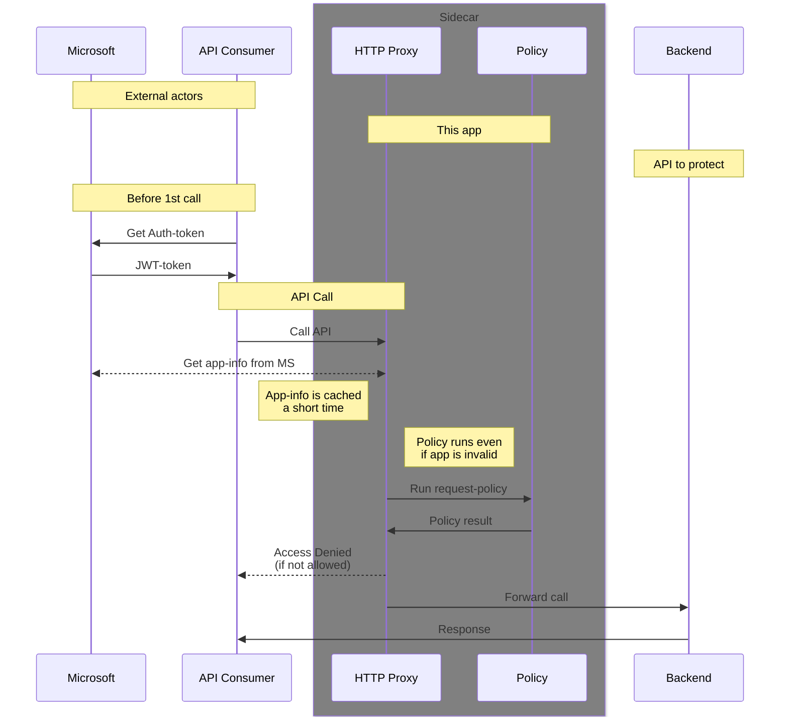

# Azure Graph Verification

The Azure Graph verification method uses Microsoft Graph API to verify the identity of applications making API requests.

## Setup Requirements

1. An Azure Service Principal with appropriate permissions
2. The Azure Tenant ID where your applications are registered

## Configuration

Set the following environment variables:
```bash
AZURE_TENANT=your-tenant-id
```

Or use command line arguments:
```bash
--azure-tenant your-tenant-id
```

## How to Get a Token

As the API consumer, you need an Azure Application registered in the same tenant. Use the following to acquire a token:

```bash
curl -X POST \
  -d "scope=https://graph.microsoft.com/.default" \
  -d "grant_type=client_credentials" \
  -d "client_id=YOUR_CLIENT_ID" \
  -d "client_secret=YOUR_CLIENT_SECRET" \
  https://login.microsoftonline.com/YOUR_TENANT_ID/oauth2/token
```

## Flowchart Azure-Graph


## Input fields for policies

| Field                       | Explanation |
| --------------------------- | ----------- |
| user.appId                  | Application ID |
| user.appOwnerOrganizationId | Azure Tenant ID |
| user.displayName            | Application Display Name |
| user.id                     | Object ID of Application |
| user.servicePrincipalType   | Type of application (usually 'Application') |
