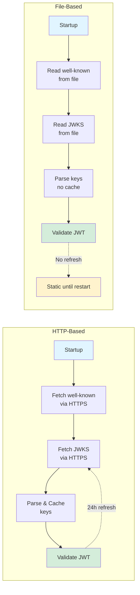

# File-Based JWKS Loading

rest-rego supports loading JWKS (JSON Web Key Set) and OIDC well-known configurations from local files for testing, air-gapped deployments, and offline environments.

## Table of Contents

- [Overview](#overview)
- [Use Cases](#use-cases)
- [File URL Formats](#file-url-formats)
- [Configuration](#configuration)
- [Source Type Consistency](#source-type-consistency)
- [Security Considerations](#security-considerations)
- [Limitations](#limitations)
- [Examples](#examples)
- [Troubleshooting](#troubleshooting)
- [Testing Workflow](#testing-workflow)

## Overview

File-based JWKS loading allows rest-rego to authenticate JWTs using keys loaded from local files instead of fetching them from remote OIDC providers over HTTP(S). This feature is designed for scenarios where internet connectivity is unavailable, restricted, or undesirable.

### Benefits

| Benefit | Description |
|---------|-------------|
| **Offline Operation** | No internet connectivity required during runtime |
| **Fast Startup** | No network latency waiting for HTTP responses |
| **Deterministic Behavior** | Keys are fixed at startup; no unexpected remote changes |
| **CI/CD Integration** | Test pipelines can run without external dependencies |
| **Air-Gapped Security** | Strict network isolation for sensitive environments |

Compared to HTTP-based JWKS:
- **Static keys**: Files are loaded once at startup with no auto-refresh
- **No caching**: Keys are read directly without cache layer
- **Explicit configuration**: Files must be pre-deployed with the application

## Use Cases

### Local Development

Run rest-rego locally without connecting to remote OIDC providers. Generate test keys, sign tokens locally, and validate them with file-based JWKS.

```bash
# Start rest-rego with local files
WELLKNOWN_OIDC=file:///home/user/config/well-known.json \
JWT_AUDIENCES=local-test-api \
rest-rego
```

### Air-Gapped Deployments

Deploy rest-rego in environments with no internet access. Pre-package JWKS files with the application and configure file paths.

### CI/CD Pipelines

Run integration tests without external dependencies. Generate ephemeral key pairs, create JWKS files, and test end-to-end authentication flows.

### Integration Testing

Test policy logic with controlled, reproducible JWT claims without requiring real identity providers or network access.

## File URL Formats

rest-rego supports standard `file:` URL syntax for both `WELLKNOWN_OIDC` and `jwks_uri` fields.

### Absolute Paths

```bash
# Triple-slash (most common)
file:///config/well-known.json

# Double-slash with localhost
file://localhost/config/well-known.json

# Single-slash (non-standard but supported)
file:/config/well-known.json
```

All three formats above resolve to `/config/well-known.json`.

### Relative Paths

Relative paths are resolved from the working directory where rest-rego is started.

```bash
# Relative to current directory
file:config/well-known.json        # → ./config/well-known.json
file:./config/well-known.json      # → ./config/well-known.json
file:../shared/well-known.json     # ❌ Rejected (path traversal)
```

**Path Traversal Prevention**: Paths containing `..` components are explicitly rejected to prevent unauthorized file access.

## Configuration

File-based JWKS requires two files: a well-known configuration and a JWKS file.

### Basic Setup

```bash
# Environment variables
WELLKNOWN_OIDC=file:///config/well-known.json
JWT_AUDIENCES=api://my-app
```

### Well-Known Configuration File

The well-known file must contain at minimum:
- `jwks_uri`: Path to the JWKS file (must also use `file:` URL)
- `id_token_signing_alg_values_supported`: List of signing algorithms

**Example**: `/config/well-known.json`

```json
{
  "issuer": "https://my-local-issuer",
  "jwks_uri": "file:///config/jwks.json",
  "id_token_signing_alg_values_supported": ["RS256"],
  "token_endpoint": "https://my-local-issuer/token",
  "authorization_endpoint": "https://my-local-issuer/authorize"
}
```

**Minimal example** (only required fields):

```json
{
  "jwks_uri": "file:///config/jwks.json",
  "id_token_signing_alg_values_supported": ["RS256"]
}
```

### JWKS File

The JWKS file contains the public keys used to verify JWT signatures. Standard format per [RFC 7517](https://datatracker.ietf.org/doc/html/rfc7517).

**Example**: `/config/jwks.json`

```json
{
  "keys": [
    {
      "kty": "RSA",
      "use": "sig",
      "kid": "test-key-1",
      "alg": "RS256",
      "n": "0vx7agoebGcQSuuPiLJXZptN9nndrQmbXEps2aiAFbWhM78LhWx4cbbfAAtVT86zwu1RK7aPFFxuhDR1L6tSoc_BJECPebWKRXjBZCiFV4n3oknjhMstn64tZ_2W-5JsGY4Hc5n9yBXArwl93lqt7_RN5w6Cf0h4QyQ5v-65YGjQR0_FDW2QvzqY368QQMicAtaSqzs8KJZgnYb9c7d0zgdAZHzu6qMQvRL5hajrn1n91CbOpbISD08qNLyrdkt-bFTWhAI4vMQFh6WeZu0fM4lFd2NcRwr3XPksINHaQ-G_xBniIqbw0Ls1jF44-csFCur-kEgU8awapJzKnqDKgw",
      "e": "AQAB"
    }
  ]
}
```

The `alg` field can be omitted if it's listed in `id_token_signing_alg_values_supported` — rest-rego will automatically add it during key loading.

### Environment Variable Examples

| Scenario | Configuration |
|----------|---------------|
| Single file-based issuer | `WELLKNOWN_OIDC=file:///config/well-known.json` |
| Multiple file-based issuers | `WELLKNOWN_OIDC=file:///config/issuer1.json,file:///config/issuer2.json` |
| Mixed file and HTTP | `WELLKNOWN_OIDC=file:///config/local.json,https://remote.example.com/.well-known/openid-configuration` |

## Source Type Consistency

**Critical Rule**: For each issuer, the well-known configuration and `jwks_uri` **must use the same source type** (both file or both HTTP).

### Valid Configurations

✅ **Both file**:
```json
{
  "jwks_uri": "file:///config/jwks.json",
  "id_token_signing_alg_values_supported": ["RS256"]
}
```

✅ **Both HTTP**:
```json
{
  "jwks_uri": "https://example.com/.well-known/jwks",
  "id_token_signing_alg_values_supported": ["RS256"]
}
```

### Invalid Configurations

❌ **File well-known → HTTP jwks_uri**:
```json
{
  "jwks_uri": "https://example.com/.well-known/jwks",
  "id_token_signing_alg_values_supported": ["RS256"]
}
```

This mismatch is rejected with error:
```
jwtsupport: source type mismatch well-known=file:///config/well-known.json 
well-known-type=file jwks-uri=https://example.com/.well-known/jwks 
jwks-type=http error=well-known and jwks_uri must use matching source types (both file or both http)
```

### Rationale

This restriction prevents confusing hybrid configurations where:
- An air-gapped deployment accidentally references external HTTP endpoints
- Network failures cause partial authentication failures
- Mixed trust levels create security ambiguities

## Security Considerations

### File Permissions

rest-rego runs as the current user and respects Unix file permissions. Ensure:
- JWKS files are readable by the rest-rego process user
- Files are **not world-writable** to prevent tampering
- Parent directories have appropriate execute permissions

```bash
# Recommended permissions
chmod 644 /config/well-known.json /config/jwks.json
chown rest-rego:rest-rego /config/*.json
```

### Path Traversal Prevention

rest-rego explicitly rejects paths containing `..` components after normalization to prevent unauthorized file access.

❌ **Rejected examples**:
```bash
file:../etc/passwd
file:config/../../etc/passwd
file:///config/../../../etc/passwd
```

All return error: `path traversal not allowed`

### No Auto-Refresh

Unlike HTTP-based JWKS (which refresh every 24 hours), file-based keys are loaded once at startup and never reloaded. This means:
- Key rotation requires a rest-rego restart
- Compromised keys remain valid until restart
- No automatic expiration or revocation

**Recommendation**: Deploy key updates through your standard deployment pipeline (e.g., Kubernetes rolling update with new ConfigMap).

### Trust Model

By using file-based JWKS, you are:
- Trusting the deployment process to provide correct keys
- Bypassing the security of HTTPS-based key distribution
- Assuming the filesystem is a trusted storage medium

This is appropriate for controlled environments but **not recommended for production internet-facing services**.

## Limitations

### Static Loading

- Files are read **once** at startup
- No file watching or automatic reload
- Key rotation requires application restart

### No Cache Layer

- File-based keys bypass the JWK cache used for HTTP sources
- Each token validation reads from the in-memory parsed key set
- Performance is still excellent (no I/O after startup)

### Restart Required for Changes

If you update JWKS files, you must restart rest-rego:

```bash
# Update files
cp new-jwks.json /config/jwks.json

# Restart (Kubernetes example)
kubectl rollout restart deployment/rest-rego
```

In Kubernetes, updating a ConfigMap triggers a rolling update automatically if mounted correctly.

## Examples

### Local Filesystem

**Directory structure**:
```
/home/user/rest-rego/
├── config/
│   ├── well-known.json
│   └── jwks.json
└── policies/
    └── request.rego
```

**Configuration**:
```bash
WELLKNOWN_OIDC=file:///home/user/rest-rego/config/well-known.json
JWT_AUDIENCES=local-api
BACKEND_PORT=8080
```

**Start rest-rego**:
```bash
cd /home/user/rest-rego
./rest-rego
```

Expected startup logs:
```
jwtsupport: loaded well-known from file url=file:///home/user/rest-rego/config/well-known.json
jwtsupport: loaded jwks from file url=file:///home/user/rest-rego/config/jwks.json keys=1
```

### Docker Volume Mount

**Dockerfile** (application code):
```dockerfile
FROM alpine:latest
COPY rest-rego /usr/local/bin/
COPY policies/ /policies/
ENTRYPOINT ["/usr/local/bin/rest-rego"]
```

**Docker Compose**:
```yaml
version: '3.8'
services:
  rest-rego:
    image: rest-rego:latest
    environment:
      WELLKNOWN_OIDC: file:///config/well-known.json
      JWT_AUDIENCES: docker-api
      BACKEND_PORT: 8080
    volumes:
      - ./config:/config:ro
    ports:
      - "8181:8181"
      - "8182:8182"
```

**Host directory**:
```
./config/
├── well-known.json
└── jwks.json
```

Start with:
```bash
docker-compose up
```

### Kubernetes ConfigMap

**ConfigMap definition**: `configmap-jwks.yaml`

```yaml
apiVersion: v1
kind: ConfigMap
metadata:
  name: rest-rego-jwks
  namespace: default
data:
  well-known.json: |
    {
      "jwks_uri": "file:///config/jwks.json",
      "id_token_signing_alg_values_supported": ["RS256"]
    }
  jwks.json: |
    {
      "keys": [
        {
          "kty": "RSA",
          "use": "sig",
          "kid": "k8s-test-key",
          "alg": "RS256",
          "n": "0vx7agoebGcQSuuPiLJXZptN9nndrQmbXEps2aiAFbWhM78LhWx4cbbfAAtVT86zwu1RK7aPFFxuhDR1L6tSoc_BJECPebWKRXjBZCiFV4n3oknjhMstn64tZ_2W-5JsGY4Hc5n9yBXArwl93lqt7_RN5w6Cf0h4QyQ5v-65YGjQR0_FDW2QvzqY368QQMicAtaSqzs8KJZgnYb9c7d0zgdAZHzu6qMQvRL5hajrn1n91CbOpbISD08qNLyrdkt-bFTWhAI4vMQFh6WeZu0fM4lFd2NcRwr3XPksINHaQ-G_xBniIqbw0Ls1jF44-csFCur-kEgU8awapJzKnqDKgw",
          "e": "AQAB"
        }
      ]
    }
```

**Deployment**: `deployment.yaml`

```yaml
apiVersion: apps/v1
kind: Deployment
metadata:
  name: rest-rego
  namespace: default
spec:
  replicas: 2
  selector:
    matchLabels:
      app: rest-rego
  template:
    metadata:
      labels:
        app: rest-rego
    spec:
      containers:
      - name: rest-rego
        image: rest-rego:latest
        env:
        - name: WELLKNOWN_OIDC
          value: "file:///config/well-known.json"
        - name: JWT_AUDIENCES
          value: "k8s-api"
        - name: BACKEND_PORT
          value: "8080"
        volumeMounts:
        - name: jwks-config
          mountPath: /config
          readOnly: true
        ports:
        - containerPort: 8181
          name: proxy
        - containerPort: 8182
          name: mgmt
      volumes:
      - name: jwks-config
        configMap:
          name: rest-rego-jwks
```

**Apply**:
```bash
kubectl apply -f configmap-jwks.yaml
kubectl apply -f deployment.yaml
```

**Update keys** (triggers rolling update):
```bash
kubectl edit configmap rest-rego-jwks
# Edit and save
# Pods will restart automatically
```

## Troubleshooting

### Common Errors

| Error | Cause | Solution |
|-------|-------|----------|
| `no such file or directory` | File path incorrect or file missing | Verify path with `ls -l /config/jwks.json` |
| `permission denied` | Insufficient read permissions | Check `chmod 644` and user ownership |
| `invalid character` / `unexpected end of JSON` | Malformed JSON in file | Validate with `jq . < file.json` |
| `source type mismatch` | File well-known → HTTP jwks_uri | Fix `jwks_uri` to use `file:` URL |
| `path traversal not allowed` | Path contains `..` | Use absolute or safe relative paths |
| `no keys loaded` | Valid JSON but wrong structure | Ensure `{"keys": [...]}` format |

### Debugging Steps

**1. Verify File Access**
```bash
# Check file exists and is readable
ls -l /config/well-known.json /config/jwks.json

# Test reading as rest-rego user
sudo -u rest-rego cat /config/well-known.json
```

**2. Validate JSON**
```bash
# Check JSON syntax
jq . < /config/well-known.json
jq . < /config/jwks.json

# Verify structure
jq '.jwks_uri' /config/well-known.json
jq '.keys | length' /config/jwks.json
```

**3. Check Startup Logs**
```bash
# Look for successful load messages
rest-rego --verbose 2>&1 | grep "jwtsupport:"

# Expected output:
# jwtsupport: loaded well-known from file url=file:///config/well-known.json
# jwtsupport: loaded jwks from file url=file:///config/jwks.json keys=1
```

**4. Test with Simple Policy**
Create a permissive policy to isolate authentication issues:

```rego
package policies

default allow = true
```

If requests succeed with `allow = true` but fail with your real policy, the issue is policy-related, not JWKS.

## Testing Workflow

Complete end-to-end workflow for testing JWT authentication with file-based JWKS.

### Flow Comparison



### Step 1: Generate RSA Key Pair

```bash
# Generate private key
openssl genrsa -out private-key.pem 2048

# Extract public key
openssl rsa -in private-key.pem -pubout -out public-key.pem

# View key details
openssl rsa -in private-key.pem -text -noout
```

### Step 2: Create JWKS File

Convert the public key to JWKS format. You can use online tools or libraries.

**Using Python** (requires `jwcrypto`):

```python
#!/usr/bin/env python3
from jwcrypto import jwk
import json

with open('public-key.pem', 'rb') as f:
    key = jwk.JWK.from_pem(f.read())

jwks = {
    'keys': [
        {
            **json.loads(key.export_public()),
            'use': 'sig',
            'kid': 'test-key-1',
            'alg': 'RS256'
        }
    ]
}

with open('jwks.json', 'w') as f:
    json.dump(jwks, f, indent=2)
```

**Using Go** (requires `github.com/lestrrat-go/jwx/v2`):

```go
package main

import (
    "crypto/rsa"
    "crypto/x509"
    "encoding/json"
    "encoding/pem"
    "os"

    "github.com/lestrrat-go/jwx/v2/jwk"
)

func main() {
    pemData, _ := os.ReadFile("public-key.pem")
    block, _ := pem.Decode(pemData)
    pub, _ := x509.ParsePKIXPublicKey(block.Bytes)
    
    key, _ := jwk.FromRaw(pub.(*rsa.PublicKey))
    _ = key.Set(jwk.KeyIDKey, "test-key-1")
    _ = key.Set(jwk.AlgorithmKey, "RS256")
    
    set := jwk.NewSet()
    _ = set.AddKey(key)
    
    data, _ := json.MarshalIndent(set, "", "  ")
    _ = os.WriteFile("jwks.json", data, 0644)
}
```

### Step 3: Create Well-Known File

```bash
cat > well-known.json <<EOF
{
  "jwks_uri": "file:///$(pwd)/jwks.json",
  "id_token_signing_alg_values_supported": ["RS256"]
}
EOF
```

### Step 4: Sign a Test JWT

**Using Python** (requires `PyJWT`):

```python
#!/usr/bin/env python3
import jwt
from datetime import datetime, timedelta

with open('private-key.pem', 'r') as f:
    private_key = f.read()

payload = {
    'iss': 'test-issuer',
    'aud': 'local-api',
    'sub': 'user-123',
    'iat': datetime.utcnow(),
    'exp': datetime.utcnow() + timedelta(hours=1)
}

token = jwt.encode(payload, private_key, algorithm='RS256', headers={'kid': 'test-key-1'})
print(token)
```

**Using online tools**:
- [jwt.io](https://jwt.io) — Paste your private key and configure payload

### Step 5: Start rest-rego

```bash
WELLKNOWN_OIDC=file:///$(pwd)/well-known.json \
JWT_AUDIENCES=local-api \
BACKEND_PORT=8080 \
rest-rego --verbose
```

Look for:
```
jwtsupport: loaded well-known from file url=file:///...
jwtsupport: loaded jwks from file url=file:///... keys=1
```

### Step 6: Test Authentication

```bash
# Test with valid token
curl -H "Authorization: Bearer YOUR_TOKEN_HERE" \
     http://localhost:8181/api/test

# Expected: Request passes to backend (if policy allows)

# Test without token
curl http://localhost:8181/api/test

# Expected: 403 Forbidden
```

### Step 7: Verify JWT Claims in Policy

Create a test policy that dumps JWT claims:

```rego
package policies

import rego.v1

default allow = false

allow if {
    input.jwt.aud == "local-api"
}

# Debug output (visible with --debug flag)
jwt_claims := input.jwt
```

Run with debug flag:
```bash
rest-rego --debug
```

Make a request and observe the logged policy input showing JWT claims.

## Related Documentation

- [JWT.md](JWT.md) — HTTP-based JWT verification and OIDC providers
- [CONFIGURATION.md](CONFIGURATION.md) — Complete configuration reference
- [POLICY.md](POLICY.md) — Policy structure and JWT claim access
- [TROUBLESHOOTING.md](TROUBLESHOOTING.md) — General debugging guide
