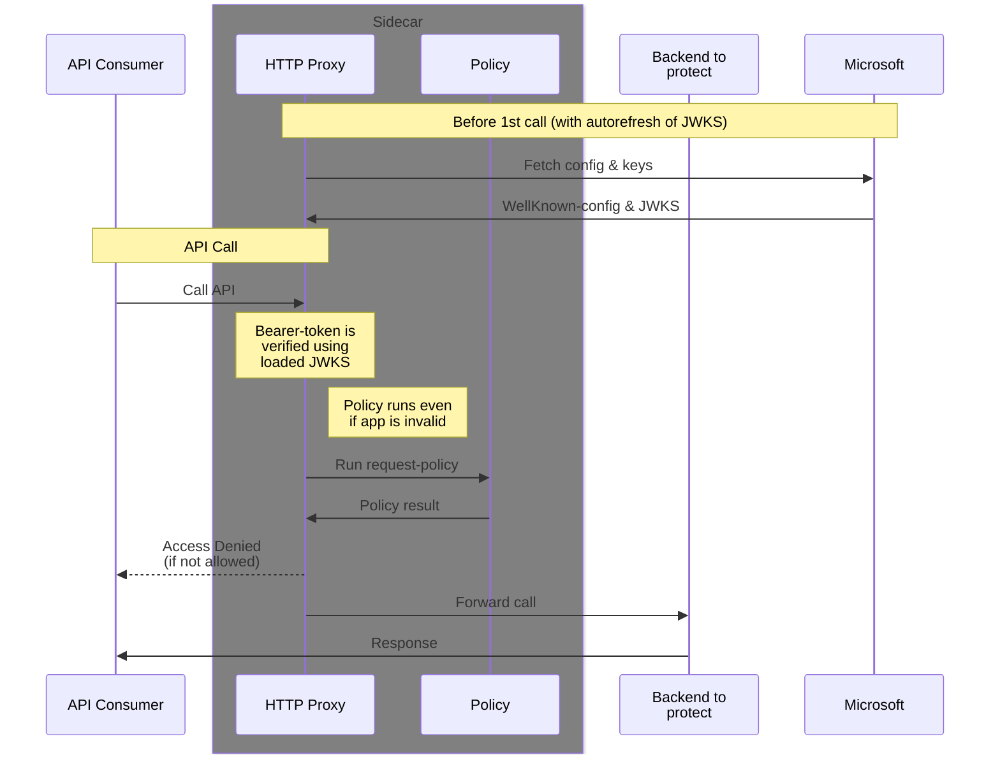

# JWT Verification

This requires a standard OIDC well-known-config URL to be provided, as well as a 'Audience'.

Currently we only have documentation for Azure, but this should be rather straight-forward to adapt to other OIDC providers.

## Azure

### Setup
You need an Azure Application to act as 'guard'.<br>
This must have an 'Application ID URI' and 'Allow public client flows' enabled (probably in the Advanced settings in the Authentication page).

Add the following arguments to 'rest-rego':
```ini
WELLKNOWN_OIDC=https://login.microsoftonline.com/$TENANT/v2.0/.well-known/openid-configuration
JWT_AUDIENCES=$GUARD_APPIDURI
```

On startup you should see a line stating '..loaded jwks..' ending with 'keys=N' (where N should be >0)

### How to get a token
As the api-consumer you also need an Azure Application (normally in the same tenant as the 'guard')


```sh
curl --request POST \
  --url https://login.microsoftonline.com/$TENANT/oauth2/v2.0/token \
  --header 'content-type: application/x-www-form-urlencoded' \
  --data "scope=$GUARD_APPIDURI/.default" \
  --data "grant_type=client_credentials" \
  --data "client_id=$APPID" \
  --data "client_secret=$APPSECRET"
```

## Flowchart JWT


## OIDC settings and JWKS (key-set)
The JWKS-URL found in the WellKnownConfig is automatically refreshed every 24 hours and updated if changed.

If the keys in the JWKS is not tagged with what algorithm they are, then we're using the list of supported algorithms from the WellKnownConfig.

## Policies

The Rego-policies will get an `input`-object similar to this (for Azure OIDC):
<br>_(use the `--debug` option to see what your setup yields)_
```json
{
  "request": {
    "method": "GET",
    "path": [...],
    "headers": {
      "Authorization": "Bearer <HIDDEN-VALUE>",
    },
    "auth": {
      "kind": "Bearer",
      "token": "<HIDDEN-VALUE>"
    },
    "size": 0
  },
  "jwt": {
    "appid": "<APPID>",
    "appidacr": "1",
    "aud": [ "<GUARD_APPIDURI>" ],
    "exp": "2025-03-24T11:41:37Z",
    "iat": "2025-03-24T10:36:37Z",
    "idp": "https://sts.windows.net/<TENANT>/",
    "iss": "https://sts.windows.net/<TENANT>/",
    "nbf": "2025-03-24T10:36:37Z",
    "oid": "<OBJECTID_OF_CONSUMER_APP>",
    "sub": "<OBJECTID_OF_CONSUMER_APP>",
    "tid": "<TENANT>",
    "ver": "1.0"
    ...
  }
}
```

This allows easy policy like the following:
```rego
allow if {
	valid_apps := {
		"11112222-3333-4444-5555-666677778888",
		"22223333-4444-5555-6666-777788889999",
		"33334444-5555-6666-7777-888899990000", # name-of-application
	}
	input.jwt.appid in valid_apps
}
```