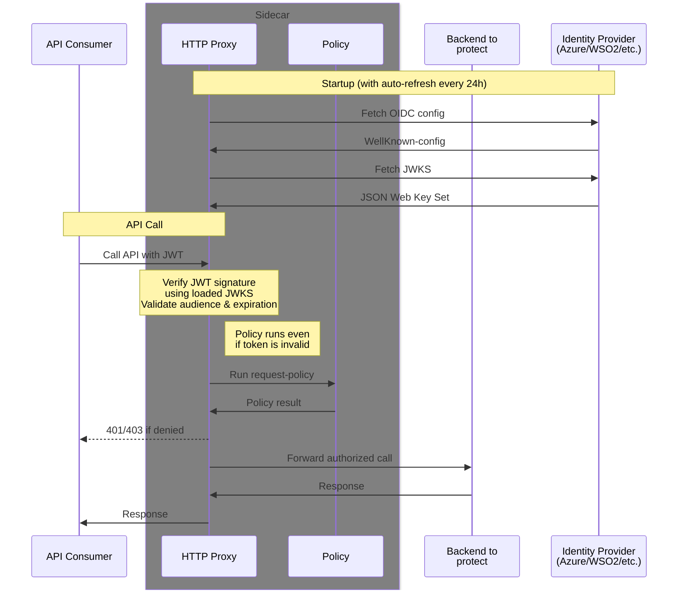

# JWT Verification

rest-rego supports JWT-based authentication using standard OIDC (OpenID Connect) providers. This document covers the general JWT verification process and provides specific configuration examples.

## Overview

JWT verification requires:
- An OIDC well-known configuration URL
- Expected audience value(s)
- Optional: Custom header names and claim keys for non-standard implementations

**Supported Identity Providers:**
- **Azure (Microsoft Entra ID)** - Standard OIDC/JWT (documented below)
- **WSO2 API Manager** - Custom JWT format with non-standard claims ([see WSO2.md](WSO2.md))
- Any standard OIDC-compliant identity provider

## Standard OIDC Configuration

For standard OIDC providers (like Azure), rest-rego automatically:
1. Fetches the OIDC discovery document from the well-known URL
2. Downloads the JSON Web Key Set (JWKS) for signature verification
3. Validates JWT tokens on each request
4. Refreshes JWKS every 24 hours

### Basic Configuration

```bash
# OIDC discovery endpoint
WELLKNOWN_OIDC=https://your-idp.example.com/.well-known/openid-configuration

# Expected audience(s) - comma-separated for multiple
JWT_AUDIENCES=api://your-app-id,api://another-app-id
```

## Azure (Microsoft Entra ID)

### Setup
You need an Azure Application to act as 'guard'.<br>
This must have an 'Application ID URI' and 'Allow public client flows' enabled (probably in the Advanced settings in the Authentication page).

Add the following arguments to 'rest-rego':
```ini
WELLKNOWN_OIDC=https://login.microsoftonline.com/$TENANT/v2.0/.well-known/openid-configuration
JWT_AUDIENCES=$GUARD_APPIDURI
```

On startup you should see a line stating '..loaded jwks..' ending with 'keys=N' (where N should be >0)

### How to get a token
As the api-consumer you also need an Azure Application (normally in the same tenant as the 'guard')


```sh
curl --request POST \
  --url https://login.microsoftonline.com/$TENANT/oauth2/v2.0/token \
  --header 'content-type: application/x-www-form-urlencoded' \
  --data "scope=$GUARD_APPIDURI/.default" \
  --data "grant_type=client_credentials" \
  --data "client_id=$APPID" \
  --data "client_secret=$APPSECRET"
```

## Request Flow



## OIDC Configuration and JWKS Management

rest-rego automatically manages OIDC configuration and cryptographic keys:

### Automatic Key Refresh
- JWKS (JSON Web Key Set) is fetched from the URL in the OIDC discovery document
- Keys are automatically refreshed every 24 hours
- Changes are detected and applied without restart

### Algorithm Detection
- rest-rego uses the algorithm (`alg`) specified in each key
- If keys don't specify an algorithm, it falls back to supported algorithms from the OIDC configuration
- Commonly supported: RS256, RS384, RS512, ES256, ES384, ES512

### Validation Process
For each incoming request with a JWT:
1. **Signature verification** - JWT is verified against JWKS public keys
2. **Audience validation** - `aud` claim must match `JWT_AUDIENCES` configuration
3. **Expiration check** - `exp` claim must be in the future
4. **Not-before check** - `nbf` claim must be in the past (if present)
5. **Issuer validation** - `iss` claim must match OIDC configuration

### Debugging Token Issues

Enable debug logging to troubleshoot JWT validation:

```bash
# Add to rest-rego arguments
--debug --verbose
```

**Common log messages:**
- `loaded jwks from {url} (keys=N)` - Successful JWKS load with N keys
- `jwt validation failed: ...` - Token signature or claim validation failed
- `audience validation failed` - Token audience doesn't match expected value

## Custom JWT Configurations

Some identity providers use non-standard JWT formats. rest-rego supports customizations:

### Custom Header Name

By default, JWTs are expected in the `Authorization` header with `Bearer` prefix. Override with:

```bash
# Custom header name (e.g., WSO2 uses X-Jwt-Assertion)
AUTH_HEADER=X-Jwt-Assertion

# Custom auth kind prefix (empty for no prefix)
AUTH_KIND=
```

### Custom Audience Claim

Standard OIDC uses the `aud` claim for audience validation. Override with:

```bash
# Custom claim key for audience (e.g., WSO2 uses a custom URI claim)
JWT_AUDIENCE_KEY=http://wso2.org/claims/apiname

# Expected audience value
JWT_AUDIENCES=YourAPIName
```

**Use Case:** WSO2 API Manager stores the API name in `http://wso2.org/claims/apiname` instead of the standard `aud` claim.

For detailed WSO2 configuration, see [WSO2.md](WSO2.md).

## Azure JWT Structure

Azure AD issues JWTs with standard claims in a flat structure. The Rego policies receive an `input` object like this:

_(Use the `--debug` option to see the exact structure for your setup)_

```json
{
  "request": {
    "method": "GET",
    "path": ["hello"],
    "headers": {
      "Authorization": "Bearer <TOKEN>",
      "User-Agent": "...",
      ...
    },
    "auth": {
      "kind": "Bearer",
      "token": "<TOKEN>"
    },
    "size": 0
  },
  "jwt": {
    "appid": "11112222-3333-4444-5555-666677778888",
    "appidacr": "1",
    "aud": ["api://your-app-id"],
    "exp": "2025-10-08T21:17:13Z",
    "iat": "2025-10-08T20:12:13Z",
    "iss": "https://sts.windows.net/tenant-id/",
    "nbf": "2025-10-08T20:12:13Z",
    "oid": "object-id-of-app",
    "sub": "object-id-of-app",
    "tid": "tenant-id",
    "ver": "1.0"
  }
}
```

### Key Azure Claims

| Claim   | Description                              | Use in Policy                      |
|---------|------------------------------------------|------------------------------------|
| `appid` | Azure AD App Registration client ID      | Primary application identifier     |
| `aud`   | Audience (your API's Application ID URI) | Validated automatically            |
| `iss`   | Issuer (Azure AD tenant)                 | Validated automatically            |
| `oid`   | Object ID of the service principal       | Optional: track specific instances |
| `tid`   | Tenant ID                                | Optional: multi-tenant scenarios   |
| `exp`   | Token expiration                         | Validated automatically            |

## Authorization Policies

### Basic Application Authorization (Azure)

Authorize based on Azure AD App Registration client ID:

```rego
package request.rego

# Deny by default
default allow := false

# Allow authorized applications
allow if {
    valid_apps := {
        "11112222-3333-4444-5555-666677778888", # app-name-1
        "22223333-4444-5555-6666-777788889999", # app-name-2
        "33334444-5555-6666-7777-888899990000", # app-name-3
    }
    input.jwt.appid in valid_apps
}
```

**Best Practice:** Always add comments with application names for maintainability.

### Forward Application Identity to Backend

Export the application ID as a custom header:

```rego
package request.rego

default allow := false

allow if {
    valid_apps := {
        "11112222-3333-4444-5555-666677778888", # app-name-1
    }
    input.jwt.appid in valid_apps
}

# Assign custom header forwarded to backend
appid := input.jwt.appid
```

**Resulting header:** `X-Restrego-Appid: 11112222-3333-4444-5555-666677778888`

### Advanced: Tenant-Based Authorization

Multi-tenant scenarios with different authorized apps per tenant:

```rego
package request.rego

default allow := false

appid := input.jwt.appid
tenant := input.jwt.tid

# Tenant 1 applications
allow if {
    tenant == "tenant-id-1"
    tenant1_apps := {
        "app-id-1",
        "app-id-2",
    }
    appid in tenant1_apps
}

# Tenant 2 applications
allow if {
    tenant == "tenant-id-2"
    tenant2_apps := {
        "app-id-3",
        "app-id-4",
    }
    appid in tenant2_apps
}
```

### Advanced: Path-Based Authorization

Different applications authorized for different endpoints:

```rego
package request.rego

default allow := false

appid := input.jwt.appid

# Public endpoints: all authorized apps
allow if {
    input.request.path[0] == "public"
    public_apps := {
        "app-id-1",
        "app-id-2",
    }
    appid in public_apps
}

# Admin endpoints: restricted apps only
allow if {
    input.request.path[0] == "admin"
    admin_apps := {
        "admin-app-id",
    }
    appid in admin_apps
}
```

## Troubleshooting

### Token Validation Failures

**Symptom:** 401 Unauthorized responses

**Common Causes:**

1. **Incorrect `WELLKNOWN_OIDC` URL**
   - Verify the OIDC discovery endpoint is accessible
   - Check rest-rego logs for "loaded jwks" message with keys count > 0
   - Test endpoint manually: `curl https://your-oidc-endpoint/.well-known/openid-configuration`

2. **Wrong audience configuration**
   - Token's `aud` claim must match `JWT_AUDIENCES` exactly
   - Azure: Use Application ID URI (e.g., `api://your-app-id`)
   - Check token claims using [jwt.io](https://jwt.io) debugger

3. **JWT expired or not yet valid**
   - Check `exp` (expiration) and `nbf` (not before) claims
   - Verify system clocks are synchronized

4. **JWKS key mismatch**
   - Token's `kid` (key ID) header must match a key in JWKS
   - JWKS is auto-refreshed every 24h; restart if immediate update needed

### Policy Failures

**Symptom:** 403 Forbidden responses with valid tokens

**Debugging Steps:**

1. **Enable debug logging:**
   ```bash
   # Add to rest-rego arguments or environment
   --debug --verbose
   ```

2. **Check policy input:**
   Debug logs show the exact `input` object passed to policies:
   ```json
   {
     "jwt": {
       "appid": "actual-app-id-from-token"
     }
   }
   ```

3. **Verify application ID:**
   - Extract `appid` from token using jwt.io
   - Ensure it's included in your policy's `valid_apps` set
   - Check for typos in the GUID

4. **Test policy syntax:**
   ```bash
   # Use OPA CLI to test policy locally
   opa eval -d policies/ -i test-input.json "data.request.rego.allow"
   ```

### Common Configuration Mistakes

| Issue | Symptom | Fix |
|-------|---------|-----|
| Wrong tenant in WELLKNOWN_OIDC | 401, "issuer validation failed" | Use correct Azure tenant ID |
| Missing `.default` in token scope | 401, "audience validation failed" | Request token with `{APPIDURI}/.default` |
| Wrong Application ID URI | 401, "audience validation failed" | Match `JWT_AUDIENCES` to App Registration |
| Case-sensitive claim names | Policy doesn't match | Use exact claim names: `appid`, not `AppId` |
| Missing `default allow := false` | Security risk, all requests allowed | Always deny by default |

## Best Practices

### Security

1. **Deny by default** - Start all policies with `default allow := false`
2. **Validate critical claims** - Check issuer, audience, expiration automatically
3. **Minimize authorized apps** - Only add necessary application IDs
4. **Use descriptive comments** - Document which application each ID represents
5. **Rotate secrets regularly** - Azure client secrets should expire and be rotated

### Policy Management

1. **Version control policies** - Track all changes in git
2. **Test in development first** - Validate policy changes before production
3. **Use sets for collections** - More efficient than multiple OR conditions
4. **Group related apps** - Organize by team or service
5. **Keep policies simple** - Complex logic is harder to audit

### Operations

1. **Monitor JWKS refresh** - Automatic refresh every 24 hours
2. **Set resource limits** - Prevent sidecar resource exhaustion
3. **Configure health checks** - Enable Kubernetes self-healing
4. **Alert on authorization failures** - High failure rates indicate issues
5. **Log denied requests** - Monitor for security events or misconfigurations

## Identity Provider Comparison

| Aspect | Azure (Entra ID) | WSO2 API Manager |
|--------|------------------|------------------|
| **OIDC Standard** | ✅ Full compliance | ⚠️ Custom extensions |
| **JWT Header** | `Authorization: Bearer` | `X-Jwt-Assertion` |
| **Audience Claim** | `aud` (standard) | `http://wso2.org/claims/apiname` |
| **Config Required** | `WELLKNOWN_OIDC`, `JWT_AUDIENCES` | + `JWT_AUDIENCE_KEY`, `AUTH_HEADER`, `AUTH_KIND` |
| **App Identifier** | `appid` (GUID) | `applicationname` + `sub` (tuple) |
| **Claims Format** | Flat, short names | Nested, URI-based names |
| **Authorization Pattern** | Simple set membership | Tuple matching |
| **Use Case** | Cloud-native, standard OIDC | On-premise API gateway |

## Integration Examples

### Kubernetes Deployment with Azure

```yaml
apiVersion: apps/v1
kind: Deployment
metadata:
  name: your-service
spec:
  template:
    spec:
      containers:
        - name: app
          image: your-app:latest
          ports:
            - containerPort: 8080
        
        - name: restrego
          image: lindex/rest-rego:latest
          env:
            - name: BACKEND_PORT
              value: "8080"
            - name: WELLKNOWN_OIDC
              value: "https://login.microsoftonline.com/your-tenant-id/v2.0/.well-known/openid-configuration"
            - name: JWT_AUDIENCES
              value: "api://your-app-id"
          ports:
            - containerPort: 8181
              name: http
          livenessProbe:
            httpGet:
              path: /healthz
              port: 8182
          readinessProbe:
            httpGet:
              path: /readyz
              port: 8182
          volumeMounts:
            - name: policies
              mountPath: /policies
      
      volumes:
        - name: policies
          configMap:
            name: your-service-policies
```

### ConfigMap with Azure Policy

```yaml
apiVersion: v1
kind: ConfigMap
metadata:
  name: your-service-policies
data:
  request.rego: |
    package request.rego
    
    default allow := false
    
    allow if {
        valid_apps := {
            "11112222-3333-4444-5555-666677778888", # production-api-client
            "22223333-4444-5555-6666-777788889999", # monitoring-service
        }
        input.jwt.appid in valid_apps
    }
    
    appid := input.jwt.appid
```

## See Also

- [WSO2.md](WSO2.md) - WSO2 API Manager integration with custom JWT format
- [AZURE.md](AZURE.md) - Azure-specific authentication details
- [Open Policy Agent Documentation](https://www.openpolicyagent.org/docs/latest/)
- [Rego Language Reference](https://www.openpolicyagent.org/docs/latest/policy-language/)
- [JWT.io Token Debugger](https://jwt.io) - Decode and inspect JWT tokens

---

*For detailed WSO2 API Manager integration with custom claims and headers, see [WSO2.md](WSO2.md).*
